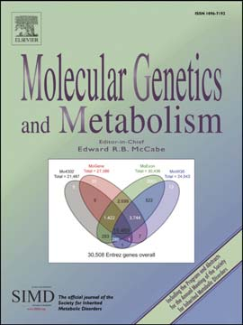
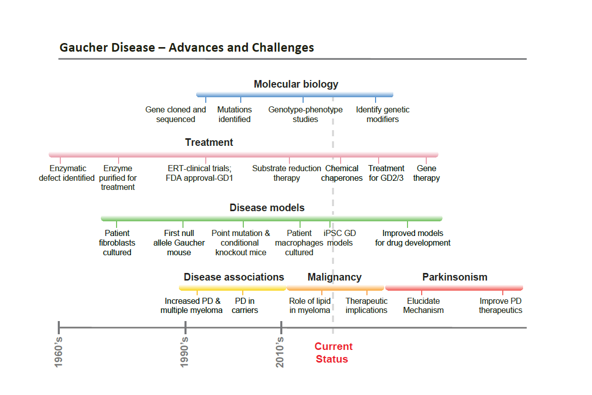

>  style="width:1.35135in;height:1.80133in" />
>
> Gaucher disease circa 2016: Progress and ongoing challenges
>
> Pramod K. Mistry, Grisel Lopez, Raphael Schiffmann, Norman W. Bar-ton,
> Neal J. Weinreb, Ellen Sidransky
>
> PII: DOI:
>
> Reference:
>
> To appear in:
>
> Received date: Revised date: Accepted date:
>
> S1096-7192(16)30323-7
> doi[:10.1016/j.ymgme.2016.11.006](http://dx.doi.org/10.1016/j.ymgme.2016.11.006)
> YMGME 6121

*Molecular* *Genetics* *and* *Metabolism*

> 13 October 2016 15 November 2016 16 November 2016
>
> Please cite this article as: Mistry, P.K., Lopez, G., Schiffmann, R.,
> Barton, N.W., Wein-reb, N.J. & Sidransky, E., Gaucher disease circa
> 2016: Progress and ongoing challenges, *Molecular* *Genetics* *and*
> *Metabolism* (2016),
> doi[:10.1016/j.ymgme.2016.11.006](http://dx.doi.org/10.1016/j.ymgme.2016.11.006)
>
> This is a PDF file of an unedited manuscript that has been accepted for
> publication. As a service to our customers we are providing this early
> version of the manuscript. The manuscript will undergo copyediting,
> typesetting, and review of the resulting proof before it is published
> in its final form. Please note that during the production process
> errors may be discovered which could affect the content, and all legal
> disclaimers that apply to the journal pertain.
>
> **ACCEPTED** **MANUSCRIPT**

**Gaucher** **Disease** **Circa** **2016:** **Progress** **and**
**Ongoing** **Challenges**

Pramod K. Mistry1, Grisel Lopez2, Raphael Schiffmann3, Norman W.
Barton4, Neal J.

Weinreb5 and Ellen Sidransky2\*

1 Yale University School of Medicine, Department of Internal Medicine,
New Haven

2 Medical Genetics Branch, National Human Genome Research Institute,
National Institutes of Health, Bethesda, MD

3 Institute of Metabolic Disease, Baylor Research Institute, Dallas, TX
75226

4 Neuroscience Division, Shire plc

5 University of Miami Miller School of Medicine, Department of Human
Genetics and Medicine (Hematology), Coral Springs, FL. 33065

Addresses and emails:

Pramod K. Mistry, Yale University School of Medicine, Department of
Internal Medicine, 333 Cedar Street, LMP 1080, P.O. Box 208019, New
Haven, CT 06520-8019: Pramod.mistry@yale.edu

Grisel Lopez, Medical Genetics Branch, NHGRI, NIH, Bld 35A Room 1E623,35
Convent Drive, Bethesda MD 20892: glopez@mail.nih.gov

Raphael Schiffmann

Institute of Metabolic Disease, Baylor Research Institute, Dallas, TX
75226 Raphael.Schiffmann@BSWHealth.org

Norman W Barton, Therapeutic Area Head Neuroscience, Shire plc,300 Shire
Way, Lexington MA 02421: nbarton@shire.com

Neal J Weinreb, University of Miami Miller School of Medicine Department
of Human Genetics and Medicine (Hematology)

UHealth Sylvester Coral Springs, 8170 Royal Palm Boulevard, Coral
Springs, FL. 33065 boneal@winning.com

\* Corresponding author: Ellen Sidransky, Medical Genetics Branch,
NHGRI, NIH, Building 35A, Room 1E623, 35 Convent Drive, Bethesda, MD
20892-3708,Tel: 301-451-0913; Fax: 301-402-6438; sidranse@mail.nih.gov

> **ACCEPTED** **MANUSCRIPT**

**Abstract:**

> Over the past decades, tremendous progress has been made in the field
> of Gaucher
>
> disease, the inherited deficiency of the lysosomal enzyme
> glucocerebrosidase. Many
>
> of the colossal achievements took place during the course of the
> sixty-year tenure of
>
> Dr. Roscoe Brady at the National Institutes of Health. These include
> the recognition of
>
> the enzymatic defect involved, the isolation and characterization of
> the protein, the
>
> localization and characterization of the gene and its nearby
> pseudogene, as well as
>
> the identification of the first mutant alleles in patients. The first
> treatment for Gaucher
>
> disease, enzyme replacement therapy, was conceived of, developed and
> tested at the
>
> Clinical Center of the National Institutes of Health. Advances
> including recombinant
>
> production of the enzyme, the development of mouse models, pioneering
> gene
>
> therapy experiments, high throughput screens of small molecules and
> the generation
>
> of induced pluripotent stem cell models have all helped to catapult
> research in
>
> Gaucher disease into the twenty-first century. The appreciation that
> mutations in the
>
> glucocerebrosidase gene are an important risk factor for parkinsonism
> further expands
>
> the impact of this work. However, major challenges still remain, some
> of which are
>
> described here, that will provide opportunities, excitement and
> discovery for the next
>
> generations of Gaucher investigators.
>
> **Keywords:**
>
> Gaucher disease, glucocerebrosidase, lysosomal storage disorder,
> Enzyme Replacement Therapy, Dr. Roscoe Brady, parkinsonism
>
> .
>
> **Abbreviations:**

ERT; enzyme replacement therapy, SRT; substrate reduction therapy, iPSC;
induced

pluripotent stem cells, *GBA1;* the glucocerebrosidase gene*,* CBE;
conduritol β-epoxide, HSP; Heat Shock Protein, ER; endoplasmic
reticulum, HDAC; histone deacetylase, NIH; National Institutes of
Health, FDA; Food and Drug Administration

> **ACCEPTED** **MANUSCRIPT**

**1** **Introduction**

With the recent passing of Roscoe Brady, an era has ended that laid the
foundation for

the contemporary field of lysosomal biology in health and disease. This
is particularly

true in the case of Gaucher disease (GD) where in the past decades much
progress

was achieved by Dr. Brady and other scientists at the National
Institutes of Health (NIH)

and around the world. It is appropriate to honor his lasting
contributions to science and

medicine through evoking the enduring lessons that his life’s work has
taught us. This

chapter will discuss the major developments made in Gaucher disease
research over

the past century, focusing on the many contributions of the NIH
(Table 1) and other

research centers. It will highlight the development of therapies for
this disorder, as well

as research advancing our knowledge of disease pathogenesis and the role
of the

lysosome in neurodegeneration. Lastly, we will identify ongoing
challenges in the field of

Gaucher disease that merit increased attention from the research
community in the

coming years.

**2.** **Progress** **in** **the** **field** **of** **Gaucher**
**disease**

**2.1** **The** **Historical** **Context**

One hundred and thirty five years ago, Gaucher disease was first
described by a French

medical student Philippe Charles-Ernest Gaucher in his thesis entitled
“De L’epithelioma

de la Rate” \[1\]. In this work, Gaucher described the presence of
unusual appearing cells

in the spleen of a 34-year-old woman who presented with splenomegaly.
The

identification of similar patients with the same pathological findings
in subsequent years

lead to the disorder being referred to as “Gaucher disease” and the
abnormal cells

> **ACCEPTED** **MANUSCRIPT**

became known as “Gaucher cells”. It was only in 1901 that Brill \[2\]
appreciated that

Gaucher disease was an inherited disorder. Neuronopathic Gaucher disease
was first

recognized in 1927 \[3\]. However, the biochemical basis for the
disorder described by

Gaucher was not identified until 1934, 50 years after Gaucher’s original
description,

when Aghion, also in Paris, determined that the distorted cells,
sketched in the

publication by Gaucher, resulted from the accumulation of the lipid
glucocerebroside \[4\].

**2.2** **Dr.** **Brady** **Enters** **the** **Field**

The reason for this lipid accumulation still remained a mystery until a
young physician

scientist, Dr. Roscoe Brady entered the scene. Dr. Brady had already
committed to this

career path during his postdoctoral fellowship, where he acquired
laboratory skills at the

University of Pennsylvania in the Department of Physiological Chemistry
under Dr.

Samuel Gurin, a pioneer in the study of lipid metabolism. Dr. Gurin had
just arranged to

receive radioactive carbon 14 from the Manhattan Project, the research
and

development project that developed the atomic bomb, and Dr. Brady began
his work

studying the metabolism of long chain fatty acids, lipids, and sterols
using radiolabeled

precursors. His early scientific work, published in a series of elegant
papers, helped

form the basis of the biochemistry of fatty acid and cholesterol
metabolism. For an

investigator interested in studying lipid metabolism, the NIH provided a
unique

opportunity for expanding his research goals, where under Dr. Donald
Fredrickson’s

leadership, a new field of ‘lipidology’ was taking shape. Instead of
joining the efforts of

these pioneering NIH investigators focused on disorders of cholesterol,
triglyceride and

lipoprotein metabolism, Dr. Brady chose to put to use his newly acquired
skills with

radioisotope tracer studies to investigate more challenging “familial
lipodystrophic

> **ACCEPTED** **MANUSCRIPT**

conditions” such as Gaucher, Niemann-Pick and Tay-Sachs disease
characterized by

intracellular accumulation of sphingolipids.

In 1956, noting that the anabolism of glucocerebroside was intact in
spleen samples of

patients with Gaucher disease \[5\], Dr. Brady turned his attention to
catabolism of the

lipid. The use of 14C labeled glucocerebroside, which he synthesized
together with Dr.

Shapiro at the Weizmann Institute in Israel, was key in establishing the
deficient

enzyme responsible for the disease \[6\]. In 1965, Dr. Brady and
coworkers in the United

States \[7\] and subsequently Dr. Patrick in the United Kingdom \[8\]
both clearly

established that the metabolic effect in Gaucher disease was the
inherited deficiency of

the enzyme glucocerebrosidase (GCase). This colossal finding started the
NIH team on

a quest to develop an effective treatment for this disorder.
Immediately, Dr. Brady

predicted that Gaucher disease could be amenable to treatment by
administration of

exogenous enzyme, and he proposed several approaches to target the
therapeutic

enzyme to the reticuloendothelial system \[9\]. This extraordinary pace
of discoveries and

conceptual advances in a space of a few years underscored the power of
traditional

isotope tracer studies and in fact, is reminiscent of the rate of
discoveries in the

genomic era \[10\].

It had long been appreciated that Gaucher disease was a diverse
disorder, and the

specific phenotypes associated with type 2GD \[11\] and type 3GD \[12\]
had been noted.

Now, deficient glucocerebrosidase was found to be responsible for all
three types of

Gaucher disease. Uncovering the deficient enzyme also enabled the Brady
group to

develop reliable diagnostic tests for Gaucher disease \[13\] using
washed concentrated

white blood cells, a method that is still in use today, albeit with
fluorescent forms of the

> **ACCEPTED** **MANUSCRIPT**

substrate and more modern technology. In addition, it also later led to
prenatal

diagnosis for this disease \[14\]. In 1968, Weinreb *et.al.* discovered
that in rat liver,

glucocerebrosidase, as well as other sphingolipid hydrolases, were
localized to

ultracentrifuge fractions identified with lysosomes \[15\]. As a result,
these diseases

became known as the lysosomal storage disorders.

2**.3** **Advances** **in** **Protein** **Chemistry**

In the following decades, research at the National Institutes of Health
performed by Dr.

Brady and other investigators significantly impacted many different
aspects of our

understanding and treatment of Gaucher disease. Dr. Brady’s mammoth
contribution

was the development and implementation of the first successful therapy
for Gaucher

disease, which later translated into enzyme replacement therapies for
other lysosomal

storage disorders. However, during the long and arduous years while the
treatment was

being developed, optimized and tested, other centennial contributions to
this field

continued to accumulate.

The road to successful enzyme replacement therapy was particularly
challenging, and

in order to move forward it was necessary to devise and develop new
tools, assays and

reagents to produce, assess, and measure parameters to follow. It
quickly became clear

that large quantities of purified enzyme were required. Achieving such
quantities was

problematic, as this was long before the era of recombinant production
of proteins. The

strong hydrophobicity of this membrane-associated enzyme necessitated
arduous

purification procedures. Eventually, Pentchev *et.al.* \[16\] developed
a method of purifying

glucocerebrosidase from placenta using affinity column chromatography,
enabling the

> **ACCEPTED** **MANUSCRIPT**

production of sufficient quantities to begin. Moreover, isolation of
this purified enzyme

facilitated its characterization \[17\], and allowed the production of
the first antibodies to

the protein, allowing scientists to determine the protein structure and
location of

carbohydrate chains.

It soon became clear that there were different isoenzymes of
glucocerebrosidase.

Isoelectric focusing of patient and control white blood cell samples
indicated that the

demonstrated differences in isozyme patterns from patients correlated
somewhat with

different types of Gaucher disease \[18\]. This finding was the first
indication that different

mutant alleles contributed to disease pathogenesis and phenotypic
expression \[19\].

While the struggle to produce adequate quantities of purified protein
for infusions was

underway, investigators at NIH and Harvard Medical School performed the
first bone

marrow transplant on a critically ill child with type 3 GD in 1984
\[20\]. Although

engraftment of the marrow was successful and some facets of the child’s
disease were

reversed, he ultimately succumbed to sepsis thirteen months
post-transplant. However,

this “proof of concept” intervention later led to the consideration of
alternative means to

correct the bone marrow function using gene therapy strategies.

Advances in purification procedure translated into more availability of
placental enzyme

for evaluation and testing. The active placental enzyme was found to
have a molecular

mass of 67kd. The protein sequence and glycosylation sites were
determined initially by

direct enzymatic and chemical cleavage with subsequent amino acid
sequencing \[21\].

Glucocerebrosidase is a membrane associated protein that is made up of
497 amino

> **ACCEPTED** **MANUSCRIPT**

acids, with five glycosylation sites \[22\]. The location of the active
site was eventually

confirmed to be located at amino acid D443 in 1994 \[23\].

**2.4** **Molecular** **Biology:** **the** **Glucocerebrosidase**
**Gene** **and** **Genotype-Phenotype**

**Studies**

While the protein sequence was being elucidated, newly available
techniques in

molecular biology enabled the characterization of the glucocerebrosidase
gene (*GBA1*).

The gene was localized to chromosome 1q21 by in-situ hybridization
analysis \[24, 25\].

The *GBA1* cDNA served as a probe to identify and isolate clones from
controls and

patients. The gene was found to encompass 11 exons spanning around 7000
base

pairs. Almost immediately, it was recognized that a highly homologous
pseudogene was

present in close proximity to *GBA1*. The elucidation of the full
sequence of *GBA1*

ultimately enabled the production of recombinant protein for therapeutic
use \[26\].

The first mutation in the glucocerebrosidase gene identified was a C to
T substitution in

exon 10, resulting in the replacement of a proline for leucine at amino
acid position 444

\[L483P\] \[27\]. Identification of the common N370S \[N409S\] mutation
was later found in a

patient with type 1 Gaucher disease \[28\]. To date more than 300
different *GBA1*

mutations have been described \[29\]. The mutation nomenclature is at
times confusing,

as the numbering of the affected amino acid was eventually changed to
include the 39

amino acid leader sequence \[shown in brackets\].

The ability to identify common *GBA1* mutations led investigators to
explore the

correlation between genotype and phenotype in this disorder. The first
two identified

mutations were reported as “type 2” and “type 1” mutations,
respectively. However, as

> **ACCEPTED** **MANUSCRIPT**

knowledge continued to accrue, it became clear that this was likely an
over-

simplification. Mutation L444P \[L483P\] was seen in patients with all
three Gaucher

disease types. Furthermore, patients sharing the same mutations, even
siblings or

twins, could have different phenotypes, complications and responses to
therapy.

Mutation L444P at times was encountered as an isolated point mutation,
and in other

instances was part of a recombinant allele resulting from recombination
with the nearby

and homologous pseudogene sequence \[30, 31\]. The N370S mutation is
generally

considered to be exclusively associated with non-neuronopathic forms of
GD, and

homozygosity for the mutation is often predictive of milder disease
features and is

frequent in asymptomatic individuals \[32\]. However, other efforts to
correlate genotype

with specific phenotype features have been incomplete, and suggest the
existence of

additional genetic modifiers \[30, 33\]. Some mutant *GBA1* alleles are
common, while

others are private, and they include point mutations, insertions,
deletions, splice-site

alterations and mutations that result from recombination with the nearby
pseudogene.

**2.5** **Enzyme** **Replacement** **Therapy** **–** **From**
**Concept** **to** **Treatment**

The actual development of glucocerebrosidase as a therapy for patients
took over two

decades \[10\]. Dr. Brady was determined to find a human source of the
enzyme to

minimize sensitization and ultimately focused on human placental
extracts. However,

this required rigorous purification, which was accomplished in 1973
\[16\]. Two patients

were infused with this material; both infusions were well tolerated
without safety issues.

Each patient underwent a pre-treatment liver biopsy for measurement of

glucocerebroside concentration, which served as a pharmacodynamic
biomarker. A

second biopsy performed two days after the infusion demonstrated a 26%
reduction in

> **ACCEPTED** **MANUSCRIPT**

glucocerebroside in both patient samples \[34\]. These important
observations set the

course for subsequent investigations that ultimately culminated in
demonstration of the

clinical effectiveness of enzyme replacement therapy. Efforts were
undertaken initially to

scale up the purification procedure for the native placental enzyme so
that larger

quantities of material would be available for clinical study. However,
enzyme purified by

the new procedure produced inconsistent reductions in hepatic
glucocerebroside, which

was attributed to variable enzyme uptake by hepatocytes versus the
desired target in

macrophages. Since native placental glucocerebrosidase is a
glycoprotein, modification

of the carbohydrate structure of the purified enzyme was attempted in
order to more

selectively target it to macrophages. This was accomplished by the
sequential

enzymatic removal of *N*-acetylneuraminic acid, galactose and *N*-
acetylglucosamine

from the protein with exoglycosidases, yielding a mannose-terminal
product \[35\]. With

this modification, a striking increase in delivery of glucocerebrosidase
to hepatic

macrophages was observed in laboratory models. Based on these findings,
a clinical

trial was initiated with intravenous infusion of the macrophage-targeted
enzyme at a

dose of 190 units weekly over a 6-month period in eight patients. Only
the youngest and

smallest subject, who received the highest dose per kilogram of body
weight (10 U/kg),

showed clinical benefit; his condition regressed when the infusions were
discontinued

\[36\]. Resumption of the infusions at a higher dose (30 U/kg body
weight) resulted in

correction of anemia, massive reduction in hepatosplenomegaly and
clearance of

storage cells from the bone marrow. This dramatic clinical response in a
single child

prompted the investigators to conduct a dose-response study in 23
Gaucher patients in

order to more thoroughly define the pharmacodynamics of glucocerebroside
clearance

> **ACCEPTED** **MANUSCRIPT**

from the liver following a single 4-hour intravenous infusion of
macrophage-targeted

enzyme; a dose range of 0.6-234 U/kg of body weight was examined \[10\].
Enzyme

doses above 30 U/kg consistently reduced hepatic glucocerebroside
content. Ultimately,

a dose of 60U/kg was chosen for a pivotal efficacy trial in twelve
subjects who received

biweekly 2-hour infusions for six months. All twelve patients showed
striking clinical

improvement in response to treatment, without safety concerns \[37\].
Macrophage-

targeted glucocerebrosidase, alglucerase, was approved under the brand
name of

Ceredase (Genzyme, Cambridge MA) by the FDA for the treatment of
non-neurological

forms of Gaucher disease in April 1991. Twenty-six years had passed
since the initial

description of the enzyme deficiency characteristic of the disorder.

**2.6** **Neuronopathic** **Gaucher** **disease**

Over the years, Dr. Brady and his group made many contributions to the
diagnosis and

treatment of patients with neuronopathic Gaucher disease. Efforts to
distinguish

neuronopathic Gaucher from non-neuropathic phenotype initially centered
on the higher

molecular weight of glucocerebrosidase in the former, which combined
with low residual

activity suggested that the neuronopathic form involves the active site
of the enzyme

\[19\]. It was recognized however, that it is the phenotype alone that
distinguishes the

various form of neuronopathic Gaucher disease \[38\].

Moreover, each type of neuronopathic Gaucher disease is clinically
heterogeneous.

Gaucher disease type 3 in particular encompasses multiple phenotypes
\[39\]. The most

common form of Gaucher disease type 3, with impaired saccadic eye
movements and

extensive visceral involvement, was named type 3b, and is described in
detail

> **ACCEPTED** **MANUSCRIPT**

neurologically and systemically \[40, 41\]. A more rare form, referred
to as type 3a,

includes the development of myoclonic epilepsy, but likewise, this type
does not have a

unique genotype \[42\]. A third variant is so distinctive from type 1
(OMIM \#230800), type

2(OMIM \#230900) and type 3 (OMIM \#231000) that it has its own OMIM
designation

(OMIM \#231005) and is called type 3c. It probably represents the most
consistent

example of genotype/phenotype correlation involving cardiac valves,
aortic calcification,

coronary artery disease and at times hydrocephalus and dysmorphic
changes

associated with homozygosity for mutation D409H \[D448H\] \[43\].

Various forms of enzyme replacement therapy for neuronopathic Gaucher
disease have

been contemplated and one of the earliest was kidney transplantation
performed with

limited success in type 2 Gaucher disease \[44\]. When alglucerase
enzyme replacement

therapy for Gaucher disease was approved in 1991 based on results from
patients with

type 1 Gaucher disease, it remained unclear whether the same
intervention would be

effective either on the systemic disease or the neurological deficits
seen in patients with

Gaucher disease type 3. An open label study in a small number of
patients with

Gaucher disease type 3 showed a marked improvement in hematological,
visceral and

even skeletal disease. Although the initial improvement in well-being in
these patients

led to a small cognitive improvement in the first six months of therapy,
it became

increasingly clear that systemically administered enzyme does not cross
the blood-brain

barrier and therefore does not truly modify the neurological outcome of
these patients

\[45-47\]. Dr. Brady and colleagues attempted to circumvent this
difficulty and determined

that the mannose receptor is expressed on the surface of neurons
allowing the uptake

of infused glucocerebrosidase directly into the brain \[48\]. However,
enzyme directly

> **ACCEPTED** **MANUSCRIPT**

infused into the cerebral spinal fluid did not impact the neurological
deterioration in

infants with type 2 Gaucher disease \[49\]. Using convection-enhanced
delivery Dr.

Brady’s team succeeded technically in delivering the therapeutic enzyme
to the brain of

small and large animals and then into the brainstem of a patient with
Gaucher type 2,

albeit without clinical improvement \[50\]. To date there is no
effective disease modifying

therapy for neurological involvement of Gaucher disease \[51\]. A small
molecule therapy

approach for neuronopathic Gaucher disease was initiated at Dr. Brady’s
Branch with a

randomized controlled trial of miglustat in patients with Gaucher type 3
\[52\]. Although

this was a negative therapeutic trial, this study generated clinical
outcome measures for

future testing of better therapeutic agents. In recent years, Dr. Brady
continued the

effort to target the central nervous system in Gaucher disease and
showed that small

molecules that function as histone deacetylase inhibitors are able to
increase the level

of the endogenous glucocerebrosidase \[53-55\]. However, effective
therapy for the

various forms of neuronopathic Gaucher disease is still elusive.
Systemically

administered therapeutic agents in the form of pharmacological
chaperones, enzyme

replacement or gene therapy that can be widely distributed into the
nervous system are

needed, whether to increase glucocerebrosidase levels or to reduce
substrate synthesis

(discussed in Section 4). But even with effective widespread biochemical
correction, the

challenge of initiating therapy sufficiently early in Gaucher disease
type 2 remains and

neurological deficits also may be irreversible in patients with Gaucher
disease type 3.

Thus, a better understanding of the natural history and the pathogenesis
of

neuronopathic Gaucher disease is needed.

**3.** **Recent** **Clinical** **Advances**

> **ACCEPTED** **MANUSCRIPT**

**3.1** **Gaucher** **Disease:** **A** **Phenotypic** **Continuum**

As our appreciation of the complexity of genotypes associated with
Gaucher disease

expanded, the recognition of the full spectrum of phenotypic
manifestations also

evolved \[56\]. Classically, it was appreciated that hepatosplenomegaly,
cytopenia,

abnormal coagulation and bone disease could all be features of Gaucher
disease type

1\. Acute neuronopathic Gaucher disease was described as a disorder of
late infancy

with opisthotonos, strabismus, seizures and neurodegeneration, while
type 3 Gaucher

disease was associated with abnormal eye movements and myoclonic
epilepsy.

However, newer disease presentations and organ involvement not
previously

associated with Gaucher disease, such as the collodian baby phenotype,
and patients

with parkinsonism, gallstones and cardiac valvular calcification or
fibrosis are now part

of the phenotypic spectrum. Moreover, asymptomatic individuals are being
discovered

through genetic screening and whole exome sequencing. It also appears
that the

phenotypes encountered may be associated with ethnicity or genetic
background.

Patients from Africa and Asia appear to have more severe presentations,
but it is not

clear whether this is related to different distributions of mutant
alleles in different

populations, or the fact that in some regions only patients with more
blatant

manifestations come to diagnosis.

**3.2** **The** **Association** **of** **Gaucher** **Disease** **and**
**Parkinsonism**

Parkinson disease is a neurodegenerative disease that affects over 1% of
people over

age 60 \[57\]. This clinical diagnosis is made when patients develop
bradykinesia

(slowness of movement) and either a rest tremor, rigidity that tends to
be initially

> **ACCEPTED** **MANUSCRIPT**

unilateral, and/or postural instability. In addition, patients have a
favorable response to

dopaminergic therapy. Symptoms are secondary to loss of dopaminergic
neurons in the

substantia nigra pars compacta, although the involvement of
non-dopaminergic

pathways has been recognized due to development of non-motor
manifestations, such

as depression or anxiety, cognitive dysfunction, sleep disorders and
olfactory

dysfunction, many years prior to the development of motor symptoms
\[58\].

The identification of specific genetic mutations associated with the
development of

Parkinson disease was first achieved in 1997, when Polymeropolous
*et.al.*

demonstrated segregation of Parkinson disease in affected individuals
carrying a

mutation in the alpha-synuclein gene in two Italian and one Greek
families \[59\]. Shortly

thereafter, Spillantini’s group demonstrated the presence of the
alpha-synuclein protein

in Lewy bodies, which are aggregate inclusions in neuronal bodies that
are crucial

pathological hallmark for a definitive diagnosis of Parkinson disease
\[60\]. To date, many

other genes, including some with highly penetrant monogenic mutations,
have been

identified \[61\]. Each gene discovery continues to significantly
advance our knowledge of

potential mechanisms contributing to neurodegeneration and the role of
mitochondria,

endoplasmic reticulum, and lysosomal pathways in neuronal cell death.

The description of occasional patients with Gaucher disease who also
developed

parkinsonian manifestations can be found in the early literature
including a small cohort

of patients affected with both diseases described in 1996 \[62\]. These
patients were

described as having parkinsonian symptoms similar to patients with
sporadic Parkinson

disease, but were thought to be refractory to dopaminergic therapy.
Investigators at the

NIH described individual patients with Gaucher disease and parkinsonism
showing

> **ACCEPTED** **MANUSCRIPT**

Lewy bodies that were in brain regions typically involved in
neuropathological Gaucher

disease \[63, 64\]\[65\] These findings gave critical credibility to the
possibility of a

Parkinson-Gaucher link. A series of 18 patients with the two phenotypes
was later

published by Tayebi *et* *al* demonstrating a range of genotypes and
disease

manifestations \[66\]. Furthermore, about 25% of patients with Gaucher
disease surveyed

reported a first- or second-degree relative with parkinsonism,
implicating heterozygous

mutation carrier status as a genetic risk factor for the development of
Parkinson disease

\[67\]. Indeed two early studies screening subjects with Parkinson
disease for *GBA1*

mutations performed in brain bank samples \[68\] and in a Parkinson
disease clinic in

Northern Israel identified a surprisingly high number of Gaucher
heterozygotes \[69\]. In

2009, a large multicenter collaborative effort that included 5691
patients with Parkinson

disease and 4898 healthy controls showed that among patients with
Parkinson disease,

the odds ratio of carrying a *GBA1* mutation was 5.43 (95% CI
3.89-7.57), confirming

that mutations in this gene are a major genetic risk factor \[70\].
*GBA1* mutations have

since been associated with other synucleinopathies \[71\] including
Dementia with Lewy

Bodies \[72\] and multiple system atrophy \[73\]. Furthermore, the role
of lysosomal

function integrity in protein aggregation and clearance has been pursued
by studying

mutations responsible for other lysosomal storage disorders, such as
Niemann-Pick

disease in cohorts with parkinsonism \[74\].

The clinical parkinsonian manifestations in patients with Gaucher
disease can be

variable, ranging from symptoms indistinguishable from sporadic
Parkinson disease

with good response to dopamine supplementation to patients with symptoms
suggestive

of Dementia with Lewy Bodies \[75\]. In addition, many patients develop
parkinsonism at

> **ACCEPTED** **MANUSCRIPT**

an earlier age at onset when compared to those without *GBA1* mutations,
as well as

cognitive and olfactory dysfunction \[76, 77\]. It has been suggested
that such patients

have a more aggressive disease course that may be associated with the
severity of the

*GBA1* mutation \[78, 79\]. Several studies emphasize accelerated
cognitive decline in

patients with *GBA1* associated parkinsonism \[79-81\]. However,
alterations such as

E326K and T369M, that do not cause Gaucher disease have also been
identified at an

increased frequency in subjects with parkinsonism \[82\].

Neuroimaging studies conducted at the NIH using 18F-dopa Positron
Emission

Tomography have shown that in patients with *GBA1*-associated
parkinsonism the

pattern of dopaminergic cell loss in the posterior putamen is
indistinguishable from

sporadic Parkinson disease. However, in this small study they had
regional cerebral

blood flow pattern deficits similar to those seen in patients with
Dementia with Lewy

Bodies that may correlate with the reported increased likelihood of
cognitive dysfunction

reported by patients and found in the literature \[83\].

The precise mechanism of neurodegeneration remains elusive at this time,
although

there are several theories proposed \[71, 84-87\]. It does appear that
there is a reciprocal

relationship between levels of glucocerebrosidase and alpha-synuclein,
as even

patients with idiopathic Parkinson disease are found to have lower
levels of

glucocerebrosidase activity in brain tissue \[88, 89\]. Elucidating the
mechanisms

involved will likely shed light on the pathogenesis of parkinsonism and
the role of the

lysosome.

**3.3** **The** **Association** **with** **malignancies**

> **ACCEPTED** **MANUSCRIPT**

From the beginning, when Dr. Phillipe Gaucher misdiagnosed his patient
with a type of

splenic neoplasm, to this day, patients with Gaucher disease presenting
with their

protean manifestations are often given an initial diagnosis of
malignancy as they

frequently begin their long diagnostic odyssey \[90\]. However, there
have been many

sporadic reports of cancers in patients with Gaucher disease and it was
a major

contributor of premature death in patients in the pre-ERT era \[91\]. In
recent years,

investigators have attempted to identify types of cancers and magnitude
of risk of

malignancy in Gaucher disease. All studies uniformly agree that there is
an increased

risk of multiple myeloma, and it appears that the risk of other
hematological

malignancies may also be increased, especially B cell lymphomas \[92\].
The

glycosphingolipid pathway is intimately involved in cancer pathogenesis,
prompting

numerous investigations to exploit it as a therapeutic target via
inhibitors of

glucocerebroside synthase or by shifting the ceramide- sphingosine
sphingolipid

rheostat towards the pro-apoptotic and anti-cancer sphingolipid ceramide
\[93\]. It

appears that of all the glycosphingolipidosis, Gaucher disease is
uniquely associated

with increased cancer risk, suggesting Gaucher lipids may have a
specific role in

promoting malignancies.

The highest cancer risk in Gaucher disease is attributable to multiple
myeloma with

relative risk ranging from 5.9 in the International Gaucher registry to
37.5-51.5 from

long-term observational cohorts from single centers \[94-96\]. The study
from the

International Gaucher registry may have under-estimated the risk because
myeloma

occurs in an older age group and the registry is not designed to capture
cancer data.

Polyclonal and monoclonal gammopathy, a finding often preceding multiple
myeloma, is

> **ACCEPTED** **MANUSCRIPT**

common in Gaucher disease. This may be suggestive of involvement of B
cells as a key

role in disease pathophysiology, a finding reinforced by the Proia group
studies in their

mouse model, which showed elevated serum IL6 and B cell
lymphoproliferation \[97\].

Numerous clinical and animal model studies have clearly implicated a
prominent role of

immune activation in the pathophysiology of Gaucher disease \[98\].
Studies of immune

activation in Gaucher disease have revealed broad involvement of innate
and adaptive

immune system \[99\] but the precise mechanism linking Gaucher lipids to
immune

activation is not understood. Genetic deficiency of glucocerebrosidase
leads to

accumulation of not only the primary lipid substrate, but also the
downstream bioactive

lipids glucosylsphingosine, sphingosine and sphingosine 1 phosphate
\[100, 101\].

Recent studies have shown that Gaucher lipids, glucocerebroside and

glucosylsphingosine are presented in CD1d-restricted fashion to type II
NKT cells that

exhibit markers of follicular helper T cells which then provide help to
germinal center B

cells to produce lipid-reactive antibodies \[102\]. In patients and mice
with Gaucher

disease that harbor monoclonal gammopathy, the monoclonal immunoglobulin
was

found to be reactive to Gaucher lipids \[103\]. In fact, in another
mouse model of Gaucher

disease that spontaneously develop myeloma and other B cell
malignancies,

therapeutic reduction of glucosylsphingosine with eliglustat tartrate
substrate reduction

therapy prevented development of these cancers \[104\]. Interestingly,
in a subset of

sporadic multiple myeloma patients, clonal immunoglobulin was also
reactive to

lysolipids, such as glucosylsphingosine and lysophosphatidylcholine.
Clearly much work

is needed to understand the basic mechanisms underlying the role of
lipids in genetic

mechanisms underlying myeloma, but this understanding could have benefit
not only for

> **ACCEPTED** **MANUSCRIPT**

patients with Gaucher disease but also patients with sporadic multiple
myeloma,

another great example where study of a rare disease provides unique
insights into

mechanisms in a more common disease. More than half-century ago Roscoe
Brady

was among the first to propose that glycolipids can act as antigens, and
he

demonstrated a role of anti-glycolipid antibodies in a human disease
when he showed

that monoclonal gammopathy associated with peripheral neuropathy was
glycolipid

reactive \[105\].

**4.** **Current** **Therapies** **for** **Gaucher** **disease**

**4.1** **Enzyme** **Replacement** **Therapy**

Prior to the availability of enzyme replacement therapy (ERT), only
symptomatic care

was available in the form of blood transfusions, splenectomy for relief
of pressure

symptoms or severe cytopenia, and joint replacement surgery. Splenectomy
was

commonly performed for symptomatic relief, but this frequently resulted
in accelerated

disease and complications involving other organs. When patients became
dependent on

blood transfusions, the natural history accelerated alarmingly, with
massive load of toxic

glycosphingolipids from the transfused red and white blood cell
membranes. The natural

history of type 1 Gaucher disease, prior to the availability of ERT, was
often one of

devastating disease, including a high incidence of splenectomy, bleeding
complications,

bone marrow failure, liver failure, crippling skeletal disease,
pulmonary hypertension,

malignancies, and premature death. Yet at the other side of the
spectrum, some

patients were identified only later in life, when they were evaluated
because of an

> **ACCEPTED** **MANUSCRIPT**

affected relative, or were incidentally found to have splenomegaly
during an evaluation

for other reasons.

Striking and rapid reversal of many of the overt aspects of type 1
Gaucher disease were

seen in pivotal clinical trials of alglucerase and and later with the
recombinant form of

the enzyme, imiglucerase (Genzyme, Cambridge, MA, USA) and have been
replicated

again and again in small series of patients from single centers as well
as a global,

industry-sponsored multinational registry comprising almost 6,000
patients that

collectively harbor ~54,000 patient-years of enzyme therapy experience
\[106\]. Enzyme

replacement therapy has proven highly effective in reversing
hepatosplenomegaly,

cytopenia, osteopenia, especially in children and young adults, and in
reducing the risk

of avascular osteonecrosis \[107\]. The new generation of patients who
have access to

enzyme replacement therapy hardly ever undergo splenectomy, and
generally begin

treatment before irreversible complications of the disease occur. As a
result, certain

phenotypes, such as pulmonary hypertension and cirrhosis/hepatopulmonary
syndrome

have virtually disappeared from modern-day clinics as hitherto unknown
aspects of

Gaucher disease have been unraveled \[65, 108\].

As with type 1 Gaucher disease, equally striking responses of visceral,
hematological

and skeletal responses have been described in patients with type 3
Gaucher disease

\[109\]. In fact, early childhood lethality due to massive visceral and
hematological

disease have been averted, although eventually, these patients may
succumb to

progressive neurological and pulmonary disease. In some, this is
aggravated by a

disabling ‘gibbus’ spinal deformity, characteristic in certain
populations of L444P

homozygotes around the world. The success of enzyme replacement therapy
in

> **ACCEPTED** **MANUSCRIPT**

reversing visceral and hematological disease has brought into focus a
major clinical

dilemma when a symptomatic infant cannot be reliably assigned with a
diagnosis of type

2 or type 3 disease. Since ERT does not cross the blood-brain barrier,
progressive type

2 disease may then be unmasked. Clearly, much progress needs to occur in
the areas

pertaining to accurate predictive phenotyping based on clinical
annotation, imaging,

biomarkers and modifier genes. Two recent studies detailing the autopsy
findings in

treated patients with Gaucher disease have demonstrated variability in
response, both

in different patients and in different organs \[110, 111\].

For a protein therapeutic, safety track record of enzyme infusions has
been remarkable.

Anaphylaxis, neutralizing antibodies and anti-IgE antibodies have
occurred in only a

handful of patients around the world \[112\]. However, up to 15% of
patients develop anti-

drug antibodies that are non-neutralizing and appear to have no effect
on efficacy of

treatment. It has been argued that in fact, presence of non-neutralizing
antibodies may

in fact improve targeting to the macrophages via Fc receptors. The
rarity of immune

adverse effects may be related to the circulating half-life of the
mannose-terminated

enzyme, which is barely a few minutes.

From 1991 to 2009, the only approved ERTs for Gaucher disease were
alglucerase and

imiglucerase. In June 2009, vesivirus 2117 contaminated one of six
bioreactors at the

manufacturing facility which led to temporary suspension of enzyme
manufacturing to

clear the virus. This event triggered a severe global shortage of
imiglucerase. At that

time, two new enzyme preparations were in advanced stages of
development:

velaglucerase-alfa (h-GCB, Shire Human Genetic Therapies, MA, USA) and

taliglucerase-alfa (pr-GCD, Protalix Biotherapeutics, Carmiel, Israel).
Global shortage of

> **ACCEPTED** **MANUSCRIPT**

imiglucerase expedited the approval process of velaglucerase-alfa and
taliglucerase-

alfa in 2010 and 2012, respectively. Velaglucerase-alfa is acid
β-glucocerebrosidase

produced by gene-activation in a human fibrosarcoma line (HT-1080)
cultured in the

presence of kifunensine, an inhibitor of mannosidase I, resulting in
primary biosynthesis

of recombinant wild type enzyme terminating in immature high
mannose-type N-linked

glycan chains. Taliglucerase-alfa is a variant human acid
β-glucocerebrosidase

manufactured in carrot root cells using a plant-specific C-terminal
sorting signal which

allows the nascent enzyme to target to storage vacuoles and moreover,
display terminal

mannose residues on its complex glycans. To facilitate secretion of the
protein via the

vacuolar pathway in plant cells, taliglucerase has unusual sugar
sequences, including

xylose. Taliglucerase has the same core amino acid sequence as
imiglucerase,

including the single amino acid substitution of histidine to arginine at
position 495. Both

velaglucerase and taliglucerase have higher mannose terminal residues,
and it has

been suggested that these may improve in vivo targeting to the
macrophage system.

Overall however, all three enzyme preparations have similar safety and
efficacy with

respect to visceral and hematological disease \[113-115\]. It is
expected that similar

efficacy with respect to marrow and skeletal disease will be seen with
longer-term

experience.

In 2016, additional ERTs may come to market, exemplified by development
of Abcertin,

claimed to utilize an identical system to that used for production of
imiglucerase.

However, clinical studies and trials are necessary to ensure that these
agents are

genuinely biosimilar or interchangeable. With the proliferation of ERTs,
two important

issues are coming into sharp focus. First, there is the need for
standardization of

> **ACCEPTED** **MANUSCRIPT**

antibody assays and secondly, a need for registries to capture safety
and efficacy data

in an unbiased and consistent manner. In the small number of patients
who develop

anti-drug antibodies, their safety depends on accurate evaluation of
reliable outcome

measures and biomarkers to discern true efficacy or lack thereof,
especially when the

patient has developed cross-reacting antibodies to multiple ERTs.
Current assays are

only offered by individual pharmaceutical companies posing its unique
challenges to

interpretation, and results are difficult to compare between
formulations.

**4.2** **Substrate** **reduction** **therapy** **(SRT)** **for**
**Gaucher** **disease**

In mid-1990s, Fran Platt and Norman Radin proposed the concept of
‘substrate balance

therapy”, via inhibition of ceramide glucosyltransferase (EC:2.4.1.80)
using their

respective candidate molecules, iminosugar (N-butyl-deoxynojirimycin,
NB-DNJ) and a

ceramide analog
(D-threo-l-phenyl-2-decanoylamino-3-morpholino-l-propanol: PDMP),

respectively \[116, 117\]. The development of NB-DNJ (miglustat,
Actelion,Allschwil,

Switzerland ) and its introduction into the clinical setting was
relatively rapid because

there was abundant pre-existing toxicology and drug
metabolism/pharmacokinetic data

in multiple species as well as pre-existing clinical safety data at high
dosage related to

its use as a potential antiviral therapy for HIV. Moreover, there was
almost one metric

ton of the drug readily available from the HIV trials \[118\].
Therefore, drug development

progressed rapidly from concept in 1994 to clinical trial in 2000 and
its approval in 2003

\[119\]. The approval of miglustat for type 1 Gaucher disease was
restricted to patients

who could not take ERT and those with mild disease due to an unfavorable
adverse

risk/benefit profile. While NB-DNJ inhibits ceramide
glucosyltransferase, its inhibitor

constant is relatively high (IC50: 50µM) and it has multiple off-target
effects (IC50 for

> **ACCEPTED** **MANUSCRIPT**

*GBA1* 520 µM, GBA2 0.31 µM). It also inhibited intestinal
disaccharidases, sucrose,

maltase and lactase as well as glucosidase I and II. Thus, the
therapeutic effect of NB-

DNJ may be more complex than simply substrate reduction, involving
inhibition of GBA2

as well as chaperoning effect. In an open label, non-inferiority design
trial comparing

miglustat with imiglucerase ERT, it met the primary end-point of
reduction in liver

volume but almost half of the patients on miglustat discontinued
treatment due to

adverse effects \[120\]. While the reversal of visceral disease with
miglustat is similar to

ERT, hematological responses are slower and of lesser magnitude compared
to ERT.

Therefore, very few patients are currently being treated with miglustat
SRT.

In contrast to miglustat, the development path for eliglustat ( Genzyme,
Cambridge, MA,

USA) was much longer, from IND filing in 2003, to initiation of clinical
trials in 2007 and

final approval for use in adults with type 1 Gaucher disease in 2014
\[121\]. The original

prototype molecule was toxic and eventually, eliglustat tartrate was
developed as one of

a series of ceramide-analog glucocerebroside synthase inhibitors,
derived from 1-

phenyl-2-decanoylamino-3-morpholino-1-propanol entering clinical trials
in 2007.

Compared to miglustat, eliglustat was a very potent inhibitor of
ceramide

glucosyltransferase (IC50 0.024 μM). It was also highly specific with
few off-target

effects.

The clinical trial program was a massive multinational effort involving
12 countries, 24

centers and almost 400 patients in a phase 2 and three phase 3 clinical
trials including a

placebo-controlled randomized trial in untreated patients over age 16
with type 1

Gaucher disease \[122-124\]. Together, these studies set a new benchmark
for the

conduct of clinical trials of novel therapies in a rare disease, a
far-cry from the pivotal

> **ACCEPTED** **MANUSCRIPT**

trials of ERTs. The drug was well tolerated and the most common adverse
reactions

affecting ~10% of patients were fatigue, headache, nausea, diarrhea,
back pain, pain in

extremities, and upper abdominal pain. The randomized placebo-controlled
clinical trial

met the primary end-point of reduction in spleen volume \[124\]. Key
secondary end-

points were also met (increase of blood hemoglobin concentration,
reduction of liver

volume and increase of platelet count) and these were analyzed with
statistical

significance with the use of a pre-specified fixed-sequence
hypothesis-testing approach

to ensure strong control of the type I error rate. Additional clinical
trials compared

maintenance of therapeutic goals in patients stable on ERT who switched
to eliglustat

using a non-inferiority design \[123\]. The primary end-point of
stability in composite

therapeutic goals were met as well as in the individual domains of
stability of

hemoglobin concentration, platelets counts, liver volume and spleen
volume. These

studies and phase 2-open label clinical trials showed reduction of
biomarkers of

Gaucher disease including chitotriosidase, CCL18, plasma
glucocerebroside,

glucosylsphingosine, and MIP1-β. Additionally, bone marrow burden score
and bone

density studies also showed improvement.

Eliglustat was approved in 2014 for use in adults with type 1 Gaucher
disease who have

cytochrome P450 2d6 genotypes indicating that they are extensive or
intermediate

metabolizers \[125\]. Eliglustat is contraindicated in patients who are
ultra-rapid

metabolizers because clinically active blood levels may not be reliably
attained. The

recommended eliglustat dose is lower in patients who are slow
metabolizers as well as

in patients who are concurrent users of interacting medications. For
patients on

medication regimens that include strong or moderate CYP2D6 inhibitors
concomitantly

> **ACCEPTED** **MANUSCRIPT**

with strong or moderate CYP3A inhibitors, eliglustat is contraindicated.
These drug

combinations can potentially increase eliglustat plasma concentrations
with risk of

cardiac arrhythmias via prolongation of PR, QTc or QRS cardiac
intervals. It is also

recommended that eliglustat not be prescribed for pregnant women or
those who are

breast feeding.

Other studies have shown that responses in treatment-naive patients are
comparable to

those seen with ERT \[126\]. A most intriguing feature of eliglustat SRT
is impressive

reversal of disease in patients with massive disease burden reminiscent
of that

observed with ERT \[122\]. This observation seems to be at variance with
the simple

concept of substrate balance therapy as initially enunciated. A clue to
this unexpected

finding may lie in 1960 paper by Trams and Brady \[5\] where they
measured

incorporation of carbon-14 glucose into glucocerebroside and found it
was actually

increased. Indeed, expression of *UGCG*, which encodes ceramide
glucosyltransferase

is increased 2-3-fold in spleens of Gaucher mice \[127\]. Moreover,
inflammation has

been associated with increased activity of ceramide glucosyltransferase
\[128\] and

glucocerebroside synthesis and Gaucher disease is now recognized as an
example of

metabolic inflammation mediated by bioactive lipids \[102\]. Thus, these
observations

suggest that increased f glucocerebroside synthesis may function to
accentuate basic

catabolic defect due to *GBA1* mutations.

**4.3** **Prospects** **for** **Gene** **Therapy**

Concurrent with successful development of ERT with macrophage-targeted
placental

glucocerebrosidase, Dr.Brady together with Dr. Karlsson at the NIH,
turned their

> **ACCEPTED** **MANUSCRIPT**

attention to assess feasibility of gene therapy as a more permanent
cure. In 1990, they

established the proof of principle using a high-titer, amphotropic
retroviral vector in

which human *GBA1* was driven by the mutant polyoma virus
enhancer/herpesvirus

thymidine kinase gene (tk) promoter (Py+/Htk) \[129\]. This vector
normalized *GBA1*

activity in transduced Gaucher fibroblasts and hemopoetic progenitor
cells derived from

patients with Gaucher disease. These studies were followed by a clinical
protocol to

explore the safety and feasibility of retroviral transduction of
peripheral blood or bone

marrow CD34+ cells in three adults with Gaucher disease followed for
6-15 months. G-

CSF was administered to mobilize target cells and CD34+ peripheral blood
cells or

CD34+ bone marrow cells were transduced ex vivo achieving transduction
efficiency of

1-10% \[130\]. Gene-marked cells were found to engraft and persist for
three months

after cell infusion, without prior myeloablation. Nevertheless, the
level of corrected cells

(\<0.02%) was too low and transient to confer any therapeutic benefit.
Since these early

efforts, the field of gene therapy has advanced greatly with
demonstration of clinical

benefits of gammaretroviral vectors in the treatment of primary immune
deficiencies.

Moreover, safety profiles have been further improved by transitioning to
lentiviral

vectors, as reflected in recent clinical success in the treatment of
X-linked

adrenoleukodystrophy, Wiskott-Aldrich syndrome and other disorders.
Recently,

Karlsson and his group have reported proof of principle studies using
self-inactivating

lentiviral vectors with *GBA1* under the control of a human
phosphoglycerate kinase and

CD68 promoter \[131\]. In their conditional KO mouse model of Gaucher
disease, they

demonstrated prevention, as well as reversal of, disease manifestations
after lentiviral

gene transfer. Therefore, these studies lay the foundation for the use
of self-inactivating

> **ACCEPTED** **MANUSCRIPT**

lentiviral vectors with cellular promoters which may play a role in
future clinical gene

therapy protocols for type 1 Gaucher disease.

**4.5Pharmacological** **Chaperones** **as** **Therapeutic**
**Approach** **for** **Gaucher** **Disease**

Small molecule chemical chaperones have been considered as a treatment
approach

for diseases caused by improperly folded proteins \[132\]. These small
molecules are

designed to selectively bind to a specific target protein and can
increase enzyme

stability, catalytic activity, and increase lysosomal translocation
\[133\]. Lysosomal

enzymes are folded in the endoplasmic reticulum (ER) with the aid of
cellular

chaperones, and are then translocated to the lysosome. When mutated, the
enzyme

may be misfolded, and undergo premature endoplasmic reticulum-associated

degradation (ERAD) and never reach the lysosome \[134\]. Treatment with
small

molecule chaperones aid in protein folding and stabilization, as well as
lysosomal

translocation. Since many *GBA1* mutations are missense mutations, this
strategy merits

consideration.

Initially, pharmacologic chaperones developed for Gaucher disease were
competitive

inhibitors of the target enzyme that bind to the active site of the
misfolded enzyme and

facilitate proper folding and translocation. Early work in patient
derived fibroblasts

suggested that the iminosugar N-nonyl-1-deoxynojirimycin (NN-DNJ)
increased mutant

glucocerebrosidase activity up to 2-fold \[135\]. Subsequently, other
iminosugar-based

dlucocerebrosidase inhibitors have been developed, but since they have a
high affinity

for glycosidases, they can have poor selectivity \[136, 137\] and also
function as

inhibitors at higher dosages. While preclinical studies appeared to be
promising \[138-

> **ACCEPTED** **MANUSCRIPT**

142\] a phase 2 clinical trial of isofagomine failed to improve clinical
symptoms in

patients with GD.

Recent efforts to develop chaperones for the treatment of GD have
utilized high

throughput screening (HTS) of small molecules. The screen of an
FDA-approved drug

library led to the identification of ambroxol, an agent widely used as
cough medicine and

a pH-dependent mixed inhibitor of glucocerebrosidase \[143\]. The
efficacy of ambroxol

as a potent chaperone and translocator of mutant glucocerebrosidase to
lysosomes was

demonstrated in cell-based and mouse models \[143-146\] and in a very
limited study in

patients with neuronopathic Gaucher disease \[147\].

Another treatment approach is the use of non-inhibitory chaperones.
These small

molecules assist in the folding of mutant enzyme in the ER and in its
translocation to

lysosomes by binding to a site that is distinct from the active site and
ideally they can

restore lysosomal enzymatic function through chaperone and enzyme
stimulatory

effects \[148\]. While such chaperones are attractive candidates for
therapeutic

development, their identification is more challenging.

To improve the yield of non-inhibitory chaperones, a novel screening
assay was

designed using patient’s tissue extracts as the source of mutant
glucocerebrosidase.

Such extracts also contain Saposin C, its native activator, and other
potential cofactors.

A patient spleen-based enzyme assay was used to screen a library of
250,000

compounds and identified several lead non-inhibitory compounds. The
ability of these

compounds to chaperone was confirmed in subsequent cell-based assays
using

patient-derived fibroblasts \[149\]. Two of the lead compounds were
tested on primary

> **ACCEPTED** **MANUSCRIPT**

macrophages differentiated from monocytes of patients with Gaucher
disease, as well

as from induced pluripotent stem cells (iPSCs) from dermal fibroblasts,
The non-

inhibitory chaperone increased glucocerebrosidase activity and lysosomal
translocation

and significantly reduced substrate storage in macrophages from patients
with different

genotypes and restored defective chemotaxis \[150\]. The lead chaperones
were then

tested in iPSC-derived dopaminergic neurons, where in addition to
restoring enzymatic

activity and reducing substrate storage, they were found to lower levels
of alpha-

synuclein \[151\]. Thus, such chaperones may ultimately also prove
efficacious for the

treatment of patients with Parkinson disease.

**4.6** **Histone** **Deacetylase** **Inhibitors**

After the successful development of ERT for type 1 Gaucher disease, a
major goal of

Dr. Brady’s research efforts was to identify tractable therapeutic
targets for

neuronopathic Gaucher disease. Using skin fibroblast cell lines derived
from patient with

neuronopathic Gaucher disease (L444P /L444P) and type 1 Gaucher disease

(N370S/370S), in a series of studies, the last of which appeared soon
after his 90th

birthday, he proposed that histone deacetylase (HDAC) inhibitors might
increase the

quantity and catalytic activity of mutant glucocerebrosidases by
affecting proteostasis

\[53, 55\]. With NIH collaborators, he showed that both N370S and L444P
mutant

glucocerebrosidase result in a reduction of protein stability, rather
than disruption of

intrinsic enzymatic activity. Both mutations led to aberrant protein
conformation that

resulted in altered chaperone binding, hence making the nascent

glucoerebrosidaseprotein vulnerable to recognition by E3 ligases (parkin
and c-cbl) and

proteasome-associated degradation. Further studies revealed that HDAC
inhibitors

> **ACCEPTED** **MANUSCRIPT**

increased the quantity and catalytic activity of mutant *GBA1* in
fibroblast via impaired

deacetylation of heat shock protein 90 that hindered the recognition of
the mutant *GBA1*

peptide and degradation, thereof. Hsp90β was identified as the key
chaperone that

recognized misfolded mutant *GBA1* to guide the nascent protein through
a valosin-

containing protein (VCP)-associated degradation pathway. In these
studies, HDAC

inhibitors caused hyperacetylation of the middle domain of Hsp90β which
impaired

recognition of mutant *GBA1* by Hsp90β and hence, resulted in increased
levels of the

active enzyme in the lysosomes. These proof-of-principle studies were
performed using

HDAC inhibitors, suberoylanilide hydroxamic acid (SAHA, vorinostat), a
clinically

available HDAC inhibitor which is CNS-penetrant, and a unique
investigational HDAC

inhibitor called LB-205. These studies are promising enough to advance
to pre-clinical

animal models and eventually to the clinic. Incidentally, vorinostat is
clinically approved

for cutaneous T cell lymphoma and of the various cancers in which it has
been

investigated, it has shown promising results in multiple myeloma. Thus,
it is tempting to

speculate a potential role of HDAC inhibitors as dual therapy for not
only neuronopathic

Gaucher disease but also type 1 Gaucher disease complicated by multiple
myeloma or

another cancers \[152\].

**The** **Development** **of** **New** **Research** **Tools**

**5.1** **Mouse** **Models** **of** **Gaucher** **disease**

While it has been long appreciated that mouse models of Gaucher disease
are an

extremely important tool for studying disease pathogenesis and drug
development, the

generation of an appropriate model has proved quite challenging. Genetic
alteration of

> **ACCEPTED** **MANUSCRIPT**

exons 9-10 of *Gba* has been the target of most animal model strategies
since this

region is most frequently mutated in Gaucher disease. The first mouse
model of

Gaucher disease was created by insertion of a Neo cassette in exons 9
and 10 by the

group of Dr. Ginns at the NIH in 1992 \[153\], effectively knocking out
all

glucocerebrosidase activity. This model replicated severe type 2 Gaucher
disease with

glucocerebroside accumulation in liver, brain and lungs, and in the
lysosomes of spleen

and liver macrophages. However, the mice died in neonatal period due to
dehydration

related to permeability barrier defects in the skin \[154\]. These
studies provided great

insight into the collodion skin phenotype associated with the most
severe type 2

Gaucher disease. It lead to the recognition that alterations in
epidermal biochemistry

and ultrastructure in patients could be used to discriminate between
type 2 and type 3

disease \[155\]. This has direct clinical utility as it is not uncommon
to come across

affected infants in whom it is not possible to distinguish clinically
between type 2 and

type 3. However, the early lethality of this model limited its utility
for therapeutic

development. Next, the Proia group, also at the NIH, utilized a single
insertion

mutagenesis procedure to develop mice harboring the ‘RecNciI’ mutation

(L444P/A456P) and mice homozygous for the L444P mutation \[156\]. Both
strains

initially died after birth. In an attempt to develop a longer lived
model homozygous for

L444P mutation, Dr. Proia crossed heterozygote mice with heterozygous
*Ugcg* *knock-*

*out* mice \[97\]. After serial intercrosses of Gba+/L444P;Ugcg+/– mice,
they obtained

L444P/L444P homozygous (GbaL444P/L444P;Ugcg+/+ mice). It is very
intriguing that

despite wild type *Ugcg*, L444P homozygous mice were not lethal and
although they

lacked Gaucher features, the model recapitulated an inflammatory
phenotype with B cell

> **ACCEPTED** **MANUSCRIPT**

lymphoproliferation. More recently, mice have been generated harboring
other

missense mutations (V394L, D409H and D409V mice) \[157\]. These mice
from the

Grabowski laboratory are long lived and express a biochemical phenotype,
but have

mild to no accumulation of Gaucher cells. Surprisingly, N370S homozygous
mice died

within 24 hours of birth owing to a skin defect, similar to *Gba*–/–
mice, despite

significantresidual glucocerebrosidase activity. A conditional GD mouse
was generated

in 2006 by the Karlsson’s laboratory using *Cre*-mediated deletion of
floxed *Gba* gene in

hematopoetic cells, achieved upon treatment with
polyinosinic-polycytidylic acid to

activate the *Mx1* promoter after birth \[158\]. These mice had a normal
life-span and

recapitulated GD phenotype more fully, with massive Gaucher
infiltration, splenomegaly

and cytopenia. A conditional mouse model of type 2 GD was generated by
the same

group through insertion of a floxed Neo cassette into *Gba* intron 8,
and homozygous

mice were then bred with keratin-14-Cre transgenic mice to rescue *Gba*
in the skin

\[159\]. These mice developed classical phenotype of type 2 Gaucher
disease and lived

~10 days. This conditional KO strategy was also used to generate another
conditional

deletion in hematopoietic cells by the Mistry group, which successfully
recapitulated

aspects the human phenotype and was instrumental in describing immune

dysregulation and metabolic inflammation as well as the role of Gba2 in
Gaucher

disease \[101, 127, 160\]. An important aspect of Gaucher disease that
is being explored

in this murine model is biliary excretion of glucocerebroside and its
bioactive lipids. In

fact, the first and only such study was by Dr.Brady’s group 35 years ago
showing

impressive biliary secretion of the stored lipids in Gaucher disease
\[161\]. Dr. Brady

> **ACCEPTED** **MANUSCRIPT**

revisited this topic recently, working to characterize the nature of
biliary transport of

Gaucher lipids in mouse models with Dr. Mistry’s group \[101\].

Recently, there has been a resurgence of interest in a chemically
induced mouse model

using conduritol β-epoxide (CBE), an inhibitor of glucocerebrosidase
first developed in

the 1970s \[162\]. The Futerman lab improved on this model though
optimizing dose and

timing of CBE administration to generate longer-lived models replicating
neuronopathic

Gaucher disease \[30\]. This system was recently employed to describe
impressive

variability of Gaucher disease phenotypes in different strains of mice
and a genome-

wide association study has led to a list of compelling candidate
modifier genes.

**5.2 Cell** **Based** **Models** **of** **Gaucher** **Disease**

Research in the field of Gaucher disease has long sought effective cell
models to

pursue a better understanding of disease pathophysiology and to develop
novel

therapeutics. Fibroblasts, while helpful for some studies, do not store
the lipid substrate.

Recently, attention has turned to developing induced pluripotent stem
cell (iPSC) lines

from patients with Gaucher disease. Several groups have successfully
generated such

lines and differentiated them into different lineages. In one study,
macrophages

differentiated from these Gaucher iPSC lines were evaluated and found to
have enzyme

deficiency, lipid storage, impaired chemotaxis, and impaired respiratory
burst \[150\].

Other investigators used Gaucher iPSCs to explore defects in
hematopoiesis, offering

insight into elements of Gaucher pathogenesis outside of macrophages
\[163\].

One field where the use of Gaucher iPSCs is especially exciting is in
exploring the link

between *GBA1* and Parkinson disease. Dopaminergic neurons have been
generated

> **ACCEPTED** **MANUSCRIPT**

both from iPSCs from Gaucher carriers and patients. In fact, one study
investigated the

differences between iPSC-derived neurons from monozygotic twins with
*GBA1*

mutations who were discordant for Parkinson disease \[164\]. Aflaki
*et.al.* recently studied

iPSC dopaminergic neurons and found that those made from patients with
Gaucher

disease showed low glucocerebrosidase activity, and elevated levels of

glucocerebroside \[151\]. iPS-derived dopaminergic neurons from patients
with Gaucher

disease with parkinsonism and type 2 Gaucher disease had elevated levels
of α-

synuclein. The cells were treated with a small molecule chaperone which
increased

glucocerebrosidase activity multifold in all Gaucher neurons and reduced
α-synuclein

levels in dopaminergic neurons derived from patients with Gaucher
disease who also

had parkinsonism. A second study by Mazzulli *et* *al* \[165\] also used
iPSC-derived

dopaminergic neurons from patients with mutations in PARK9, an A53T
mutation in α-

synuclein, an α-synuclein triplication, one patient with Gaucher
disease, and one with

idiopathic Parkinson disease to evaluate one of these previously
described non-

inhibitory chaperones of glucocerebrosidase. Treatment with the small
molecule

reduced substrate levels and pathological α-synuclein, also indicating
that such

chaperones may prove beneficial for the treatment of synucleinopathies.

**6.** **Major** **Ongoing** **Challenges** **in** **the** **Field**
**of** **Gaucher** **Disease**

This is truly an exciting time for research in the field of Gaucher
disease. When Dr.

Brady began his work in the field the resources, tools and information
available to him

were quite limited. Currently, the number of publications, companies,
organizations,

websites and conferences focused on Gaucher disease are truly
remarkable. The past

decades have provided new insights, tools and treatments (Figure 1) and
Gaucher

> **ACCEPTED** **MANUSCRIPT**

disease has become a beacon, illuminating research directions for other
lysosomal

storage disorders.. In addition, the link with parkinsonism has opened
new avenues of

research and has infused additional energy into the field, and, as a
result, the numbers

of publications in this field are rising exponentially. It is especially
gratifying to see that

research directed toward a rare disease may have important implications
for a common

complex disorder.

Below are many of the questions and topics that the coauthors feel will
be important to

study in the coming years:

> **1.** **Explaining** **phenotypic** **heterogeneity** **in** **a**
> **single** **gene** **disorder**: Determining
>
> (rather than speculating on) whether and to what extent environmental
> (both pre-
>
> natal and post-natal) exposures (such as viral or other infections)
> influence the
>
> phenotypes of both type 1 and type 3 Gaucher disease remains elusive.
> This will
>
> be even more important if newborn screening becomes more prevalent.
> Studies
>
> of patients with identical genotypes and discordant phenotypes,
> especially
>
> discordant sibling pairs should help in this endeavor. Next-generation
> whole
>
> exome or whole genome strategies should facilitate these studies.
> Because of
>
> the relative rarity of Gaucher disease, large multicenter
> collaborative studies may
>
> be required in order to achieve the power necessary for the
> identification of
>
> genetic modifiers.
>
> **2.** **Understanding** **the** **different** **organ**
> **involvement** **in** **Gaucher** **disease:** It will be
>
> important to determine why bone is such a susceptible target for
> infarction and
>
> necrosis and why these stochiastic bone complications continue to
> occur despite
>
> ERT. What is the cause of the gibbus deformity in some patients with
> Gaucher
>
> **ACCEPTED** **MANUSCRIPT**
>
> disease? Furthermore, why do some patients develop pulmonary
> involvement
>
> and why is it relatively resistant to treatment? Defining the basic
> mechanisms by
>
> which splenectomy, especially when performed in young patients, exerts
> a
>
> deleterious effect especially on bone and lung, might contribute to a
> better
>
> understanding of the pathophysiology in non-splenectomized patients.
>
> **3.** **Establishing** **the** **full** **impact** **of** **Gaucher**
> **disease** **on** **macrophage** **function**:
>
> How do the cellular impairments seen in Gaucher macrophages influence
>
> disease manifestations and progression? To what extent do platelets,
> endothelial
>
> cells and/or circulating microparticles contribute to bone and other
> pathology
>
> either intrinsically or under the influence of inflammatory cytokines
> and
>
> chemokines? In addition to documenting abnormal increases in these
>
> inflammatory mediators, understanding why and which are abnormally
> increased
>
> in certain patients and not in others, and defining the actual
> pathways by which
>
> they contribute to clinical events will be important. From an
> epidemiologic
>
> perspective, what is the actual prevalence of the immunological (T
> cell, Tregs,
>
> NKT cells) abnormalities described in Gaucher disease models and
> patients, and
>
> do they consistently correlate with glucosylsphingosine levels in
> untreated and
>
> treated patients? Is there a way to prevent malignancies or provide
> targeted
>
> therapeutics?
>
> **4.** **Determining** **the** **relative** **efficacy** **of**
> **different** **treatment** **modalities:** Are the
>
> longer term outcomes, including bone events and propensity for
> parkinsonism,
>
> myeloma and other malignancies, different in patients treated with SRT
> rather
>
> than ERT and how does this compare to untreated patients? Are there
>
> **ACCEPTED** **MANUSCRIPT**
>
> advantages in combining these different therapeutic strategies? How
> can we best
>
> compare therapeutic outcomes when new treatments like pharmacologic
>
> chaperones or HDAC inhibitors are developed? How can data be accessed
> by all
>
> when much is held in specific industry-sponsored registries? Why do
> autopsy
>
> studies indicate variable responses to therapy and what other factors
> contribute
>
> to the differences in effectiveness seen?
>
> **5.** **Identifying** **improved** **biomarkers** **to** **inform**
> **treatment** **decisions** **and** **to**
>
> **predict** **prognosis**: How can we discern which subjects are
> likely to need
>
> therapeutic intervention and when? This will be particularly critical
> as more
>
> patients are identified by screening.
>
> **6.** **Reducing** **the** **cost** **of** **treatment** **for**
> **Gaucher** **disease:** How can we make
>
> therapy accessible to all patients around the globe?
>
> **7.** **Clearly** **defining** **the** **mechanism** **underlying**
> **the** **association** **between**
>
> **Gaucher** **disease** **and** **parkinsonism**: Why are carriers of
> a single *GBA*1
>
> mutation at increased risk of developing parkinsonism? What are the
> implications
>
> for treatment of Parkinson disease and for understanding pathways
> contributing
>
> to disease pathogenesis? Why is *GBA1*-associated parkinsonism
> associated with
>
> an earlier disease onset and often with cognitive impairment? What
> determines
>
> the anatomical distribution of protein aggregation responsible for the
> different
>
> clinical parkinsonian presentations? Identification of novel ligands
> and or
>
> chemical changes that could act as surrogate biomarkers of disease
> progression
>
> and can be followed over time to assess treatment efficacy are crucial
> to
>
> accurate determination of response in future clinical trials.
>
> **ACCEPTED** **MANUSCRIPT**
>
> **8.** **Identifying** **the** **mechanisms** **underlying**
> **neuronopathic** **Gaucher** **disease**:
>
> How can we explain the vast diversity of phenotypes encountered? What
> is the
>
> reason for involvement of the saccadic eye movements? Why is mutation
> D409H
>
> associated with such a unique phenotype (Gaucher disease type 3C)?
> What
>
> determines who develops myoclonic epilepsy?
>
> **9.** **Elucidating** **the** **best** **therapeutic** **strategy**
> **for** **neuronopathic** **GD:** Assuming
>
> that new treatments (SRTs, chaperones) are active in the CNS, how
> early does
>
> treatment have to be started to prevent or arrest clinical CNS
> pathology. Can
>
> existent disease be reversed and when does it become irreversible?
>
> **10.Understanding** **the** **natural** **history** **and**
> **prevalence** **of** **GD** **in** **other**
>
> **continents:** Much of the data collected on Gaucher disease has
> primarily come
>
> from specific regions such as North and South America, Europe and
> Israel. How
>
> does Gaucher disease present and develop in other continents and what
> do
>
> these differences teach us about the disorder?
>
> **11.Identifying** **and** **training** **the** **next**
> **generation** **of** **Gaucher** **investigators**: Many
>
> of the current investigators were trained in the previous century. How
> do we
>
> ensure leadership and continuity in the field? In which specialty
> programs will
>
> they find the best home?
>
> **ACCEPTED** **MANUSCRIPT**

**Acknowledgements:**

The work of GL and ES was supported by the intramural program of the
National

Human Genome Research Institutes and the National Institute of Health.
The Sidransky

laboratory received research support under a Cooperative Research and
Development

Agreement with Merck.

PKM is supported by a grant from the National Institutes of Arthritis,
Musculoskeletal

and Skin Diseases AR 65932 and Center of Excellence Grant in Clinical
Translational

Research from Genzyme, a Sanofi Company. He has received research
support,

honoraria and consulting fees from Genzyme.

RS has received research support from Shire, Protalix Biotherapeutics
and Amicus

Therapeutics

NWB is an employee of Shire.

NJW serves on Medical or Scientific Advisory Boards for Genzyme-Sanofi,
Shire HGT

and Pfizer for which he has received honoraria. He has consulted for
Genzyme-Sanofi

and for Pfizer and has received research support from Genzyme-Sanofi and
from Shire

HGT.

**Figure** **legend**

Timeline illustrating some of the progress made in different aspects of
Gaucher disease

and the ongoing challenges.

> **ACCEPTED** **MANUSCRIPT**

**References**

\[1\] P. Gaucher, De L'epithelioma primitif de la rate, hypertrophie
idiopathique de la rate sans leucemie (1882).

\[2\] N.E. Brill, Primary splenomegaly with a report of three cases
occuring in one family American Journal of Medical Science 121 (1901)
377-392.

\[3\] W.P. Oberling C, Rev Franc de Ped III (1927) 475.

\[4\] A. E, La maladie de Gaucher dans l'enfance, Faculté de Médicine,
Paris, 1934.

\[5\] E.G. Trams, R.O. Brady, Cerebroside synthesis in Gaucher's disease
The Journal of clinical investigation 39 (1960) 1546-1550.

\[6\] R.O. Brady, J. Kanfer, D. Shapiro, THE METABOLISM OF
GLUCOCEREBROSIDES. I. PURIFICATION AND PROPERTIES OF A
GLUCOCEREBROSIDE-CLEAVING ENZYME FROM SPLEEN TISSUE The Journal of
biological chemistry 240 (1965) 39-43.

\[7\] R.O. Brady, J.N. Kanfer, D. Shapiro, METABOLISM OF
GLUCOCEREBROSIDES. II. EVIDENCE OF AN ENZYMATIC DEFICIENCY IN GAUCHER'S
DISEASE Biochemical and biophysical research communications 18 (1965)
221-225.

\[8\] A.D. Patrick, A Deficiency of Glucocerebrosidase in Gaucher
Disease Biochemical Journal 97 (1965) 17C-24C.

\[9\] R.O. Brady, The sphingolipidoses The New England journal of
medicine 275 (1966) 312-318. \[10\] N.W. Barton, Brady, R.O.,
Macrophage-targeted glucocerebrosidase : a therapeutically effective
enzyme replacement product for Gaucher disease, in: L.A.a.S. S (Ed.),
Pharmaceutical Enzymes, Marcel Dekker, New York, 1997, pp. 261-283.

\[11\] E.J. Kraus, Zur Kenntnis der Splenomegalie Gaucher, insbesondere
der Histogenese der Grobzellen Wucherung Z. Angew. Anat. 7 (1920) 186.

\[12\] P.O. Hillborg, \[Gaucher's disease in Norrbotten\] Nordisk
medicin 61 (1959) 303-306.

\[13\] J.P. Kampine, R.O. Brady, J.N. Kanfer, M. Feld, D. Shapiro,
Diagnosis of gaucher's disease and niemann-pick disease with small
samples of venous blood Science (New York, N.Y.) 155 (1967) 86-88.
\[14\] E.L. Schneider, W.G. Ellis, R.O. Brady, J.R. McCulloch, C.J.
Epstein, Infantile (type II) Gaucher's disease: in utero diagnosis and
fetal pathology The Journal of pediatrics 81 (1972) 1134-1139.

\[15\] N.J. Weinreb, R.O. Brady, A.L. Tappel, The lysosomal localization
of sphingolipid hydrolases Biochimica et biophysica acta 159 (1968)
141-146.

\[16\] P.G. Pentchev, R.O. Brady, S.R. Hibbert, A.E. Gal, D. Shapiro,
Isolation and characterization of glucocerebrosidase from human
placental tissue The Journal of biological chemistry 248 (1973)
5256-5261.

\[17\] F.S. Furbish, H.E. Blair, J. Shiloach, P.G. Pentchev, R.O. Brady,
Enzyme replacement therapy in Gaucher's disease: large-scale
purification of glucocerebrosidase suitable for human administration
Proceedings of the National Academy of Sciences of the United States of
America 74 (1977) 3560-3563. \[18\] E.I. Ginns, R.O. Brady, D.W.
Stowens, F.S. Furbish, J.A. Barranger, A new group of glucocerebrosidase
isozymes found in human white blood cells Biochemical and biophysical
research communications 97 (1980) 1103-1107.

\[19\] E.I. Ginns, R.O. Brady, S. Pirruccello, C. Moore, S. Sorrell,
F.S. Furbish, G.J. Murray, J. Tager, J.A. Barranger, Mutations of
glucocerebrosidase: discrimination of neurologic and non-neurologic
phenotypes of Gaucher disease Proceedings of the National Academy of
Sciences of the United States of America 79 (1982) 5607-5610.

\[20\] J.M. Rappeport, E.I. Ginns, Bone-marrow transplantation in severe
Gaucher's disease The New England journal of medicine 311 (1984) 84-88.

> **ACCEPTED** **MANUSCRIPT**

\[21\] S. Takasaki, G.J. Murray, F.S. Furbish, R.O. Brady, J.A.
Barranger, A. Kobata, Structure of the N-asparagine-linked
oligosaccharide units of human placental beta-glucocerebrosidase The
Journal of biological chemistry 259 (1984) 10112-10117.

\[22\] B.M. Martin, E. Sidransky, E.I. Ginns, Gaucher's disease:
advances and challenges Advances in pediatrics 36 (1989) 277-306.

\[23\] S. Miao, J.D. McCarter, M.E. Grace, G.A. Grabowski, R. Aebersold,
S.G. Withers, Identification of Glu340 as the active-site nucleophile in
human glucocerebrosidase by use of electrospray tandem mass spectrometry
The Journal of biological chemistry 269 (1994) 10975-10978.

\[24\] E.I. Ginns, P.V. Choudary, S. Tsuji, B. Martin, B. Stubblefield,
J. Sawyer, J. Hozier, J.A. Barranger, Gene mapping and leader
polypeptide sequence of human glucocerebrosidase: implications for
Gaucher disease Proceedings of the National Academy of Sciences of the
United States of America 82 (1985) 7101-7105.

\[25\] R.A. Barneveld, W. Keijzer, F.P. Tegelaers, E.I. Ginns, A. Geurts
van Kessel, R.O. Brady, J.A. Barranger, J.M. Tager, H. Galjaard, A.
Westerveld, A.J. Reuser, Assignment of the gene coding for human
beta-glucocerebrosidase to the region q21-q31 of chromosome 1 using
monoclonal antibodies Human genetics 64 (1983) 227-231.

\[26\] O. Reiner, M. Wigderson, M. Horowitz, Structural analysis of the
human glucocerebrosidase genes DNA (Mary Ann Liebert, Inc.) 7 (1988)
107-116.

\[27\] S. Tsuji, P.V. Choudary, B.M. Martin, B.K. Stubblefield, J.A.
Mayor, J.A. Barranger, E.I. Ginns, A mutation in the human
glucocerebrosidase gene in neuronopathic Gaucher's disease The New
England journal of medicine 316 (1987) 570-575.

\[28\] S. Tsuji, B.M. Martin, J.A. Barranger, B.K. Stubblefield, M.E.
LaMarca, E.I. Ginns, Genetic heterogeneity in type 1 Gaucher disease:
multiple genotypes in Ashkenazic and non-Ashkenazic individuals
Proceedings of the National Academy of Sciences of the United States of
America 85 (1988) 2349-2352.

\[29\] K.S. Hruska, M.E. LaMarca, C.R. Scott, E. Sidransky, Gaucher
disease: mutation and polymorphism spectrum in the glucocerebrosidase
gene (GBA) Human mutation 29 (2008) 567-583. \[30\] A.D. Klein, N.S.
Ferreira, S. Ben-Dor, J. Duan, J. Hardy, T.M. Cox, A.H. Merrill, Jr.,
A.H. Futerman,

Identification of Modifier Genes in a Mouse Model of Gaucher Disease
Cell reports 16 (2016) 2546-2553. \[31\] N. Tayebi, B.K. Stubblefield,
J.K. Park, E. Orvisky, J.M. Walker, M.E. LaMarca, E. Sidransky,
Reciprocal and nonreciprocal recombination at the glucocerebrosidase
gene region: implications for complexity in Gaucher disease American
journal of human genetics 72 (2003) 519-534.

\[32\] G.A. Grabowski, Phenotype, diagnosis, and treatment of Gaucher's
disease Lancet (London, England) 372 (2008) 1263-1271.

\[33\] O. Goker-Alpan, K.S. Hruska, E. Orvisky, P.S. Kishnani, B.K.
Stubblefield, R. Schiffmann, E. Sidransky, Divergent phenotypes in
Gaucher disease implicate the role of modifiers Journal of medical
genetics 42 (2005) e37.

\[34\] R.O. Brady, P.G. Pentchev, A.E. Gal, S.R. Hibbert, A.S. Dekaban,
Replacement therapy for inherited enzyme deficiency. Use of purified
glucocerebrosidase in Gaucher's disease The New England journal of
medicine 291 (1974) 989-993.

\[35\] F.S. Furbish, C.J. Steer, N.L. Krett, J.A. Barranger, Uptake and
distribution of placental glucocerebrosidase in rat hepatic cells and
effects of sequential deglycosylation Biochimica et biophysica acta 673
(1981) 425-434.

\[36\] N.W. Barton, R.O. Brady, J.M. Dambrosia, S.H. Doppelt, S.C. Hill,
C.A. Holder, H.J. Mankin, G.J. Murray, G.C. Zirzow, R.I. Parker,
Dose-dependent responses to macrophage-targeted glucocerebrosidase in a
child with Gaucher disease The Journal of pediatrics 120 (1992) 277-280.

\[37\] N.W. Barton, R.O. Brady, J.M. Dambrosia, A.M. Di Bisceglie, S.H.
Doppelt, S.C. Hill, H.J. Mankin, G.J. Murray, R.I. Parker, C.E. Argoff,
et al., Replacement therapy for inherited enzyme deficiency--

> **ACCEPTED** **MANUSCRIPT**

macrophage-targeted glucocerebrosidase for Gaucher's disease The New
England journal of medicine 324 (1991) 1464-1470.

\[38\] R.O. Brady, N.W. Barton, G.A. Grabowski, The role of
neurogenetics in Gaucher disease Archives of neurology 50 (1993)
1212-1224.

\[39\] V.A. Tylki-Szymanska A, El-Beshlawy A, Cole JA, Kolodny E,
Neuronopathic Gaucher disease: demographic and clinical features of 131
patients enrolled in the International Collaborative Gaucher Group
Neurological Outcomes Subregistry Journal of inherited metabolic disease
33 (2010) 339-346. \[40\] M.C. Patterson, M. Horowitz, R.B. Abel, J.N.
Currie, K.T. Yu, C. Kaneski, J.J. Higgins, R.R. O'Neill, P. Fedio, A.
Pikus, et al., Isolated horizontal supranuclear gaze palsy as a marker
of severe systemic involvement in Gaucher's disease Neurology 43 (1993)
1993-1997.

\[41\] E. Sidransky, S. Tsuji, B.K. Stubblefield, J. Currie, E.J.
FitzGibbon, E.I. Ginns, Gaucher patients with oculomotor abnormalities
do not have a unique genotype Clinical genetics 41 (1992) 1-5.

\[42\] J.K. Park, E. Orvisky, N. Tayebi, C. Kaneski, M.E. Lamarca, B.K.
Stubblefield, B.M. Martin, R. Schiffmann, E. Sidransky, Myoclonic
epilepsy in Gaucher disease: genotype-phenotype insights from a rare
patient subgroup Pediatric research 53 (2003) 387-395.

\[43\] A. Abrahamov, D. Elstein, V. Gross-Tsur, B. Farber, Y. Glaser, I.
Hadas-Halpern, S. Ronen, M. Tafakjdi, M. Horowitz, A. Zimran, Gaucher's
disease variant characterised by progressive calcification of heart
valves and unique genotype Lancet (London, England) 346 (1995)
1000-1003.

\[44\] S.J. Desnick, R.J. Desnick, R.O. Brady, P.G. Pentchev, R.L.
Simmons, J.S. Najarian, K. Swaiman, H.L. Sharp, W. Krivit, Renal
transplantation in Type II Gaucher disease Birth defects original
article series 9 (1973) 109-119.

\[45\] R. Schiffmann, M.P. Heyes, J.M. Aerts, J.M. Dambrosia, M.C.
Patterson, T. DeGraba, C.C. Parker, G.C. Zirzow, K. Oliver, G. Tedeschi,
R.O. Brady, N.W. Barton, Prospective study of neurological responses to
treatment with macrophage-targeted glucocerebrosidase in patients with
type 3 Gaucher's disease Annals of neurology 42 (1997) 613-621.

\[46\] G. Altarescu, S. Hill, E. Wiggs, N. Jeffries, C. Kreps, C.C.
Parker, R.O. Brady, N.W. Barton, R. Schiffmann, The efficacy of enzyme
replacement therapy in patients with chronic neuronopathic Gaucher's
disease The Journal of pediatrics 138 (2001) 539-547.

\[47\] W. Benko, M. Ries, E.A. Wiggs, R.O. Brady, R. Schiffmann, E.J.
Fitzgibbon, The saccadic and neurological deficits in type 3 Gaucher
disease PloS one 6 (2011) e22410.

\[48\] G.C. Zirzow, O.A. Sanchez, G.J. Murray, R.O. Brady, E.H.
Oldfield, Delivery, distribution, and neuronal uptake of exogenous
mannose-terminal glucocerebrosidase in the intact rat brain
Neurochemical research 24 (1999) 301-305.

\[49\] C.G. Bembi B, Zanatta M, Bottega M, Pelos G, Gornati R, Berra B,
Cerebrospinal-fluid infusion of Alglucerase in the Treatment of
Acuteneuronopathic Gauchers-Disease Pediatric research 38 (1995) 425.
\[50\] R.R. Lonser, R. Schiffman, R.A. Robison, J.A. Butman, Z. Quezado,
M.L. Walker, P.F. Morrison, S. Walbridge, G.J. Murray, D.M. Park, R.O.
Brady, E.H. Oldfield, Image-guided, direct convective delivery of
glucocerebrosidase for neuronopathic Gaucher disease Neurology 68 (2007)
254-261.

\[51\] K. Weiss, A.N. Gonzalez, G. Lopez, L. Pedoeim, C. Groden, E.
Sidransky, The clinical management of Type 2 Gaucher disease Molecular
genetics and metabolism 114 (2015) 110-122.

\[52\] R. Schiffmann, E.J. Fitzgibbon, C. Harris, C. DeVile, E.H.
Davies, L. Abel, I.N. van Schaik, W. Benko, M. Timmons, M. Ries, A.
Vellodi, Randomized, controlled trial of miglustat in Gaucher's disease
type 3 Annals of neurology 64 (2008) 514-522.

\[53\] J. Lu, C. Yang, M. Chen, D.Y. Ye, R.R. Lonser, R.O. Brady, Z.
Zhuang, Histone deacetylase inhibitors prevent the degradation and
restore the activity of glucocerebrosidase in Gaucher disease
Proceedings of the National Academy of Sciences of the United States of
America 108 (2011) 21200-21205.

> **ACCEPTED** **MANUSCRIPT**

\[54\] R.O. Brady, C. Yang, Z. Zhuang, An innovative approach to the
treatment of Gaucher disease and possibly other metabolic disorders of
the brain Journal of inherited metabolic disease 36 (2013) 451-454.

\[55\] C. Yang, S. Rahimpour, J. Lu, K. Pacak, B. Ikejiri, R.O. Brady,
Z. Zhuang, Histone deacetylase inhibitors increase glucocerebrosidase
activity in Gaucher disease by modulation of molecular chaperones
Proceedings of the National Academy of Sciences of the United States of
America 110 (2013) 966-971.

\[56\] E. Sidransky, Gaucher disease: complexity in a "simple" disorder
Molecular genetics and metabolism 83 (2004) 6-15.

\[57\] R. Savica, B.F. Boeve, G. Logroscino, Epidemiology of
alpha-synucleinopathies: from Parkinson disease to dementia with Lewy
bodies Handbook of clinical neurology 138 (2016) 153-158.

\[58\] H. Reichmann, M.D. Brandt, L. Klingelhoefer, The nonmotor
features of Parkinson's disease: pathophysiology and management advances
Current opinion in neurology 29 (2016) 467-473.

\[59\] M.H. Polymeropoulos, C. Lavedan, E. Leroy, S.E. Ide, A. Dehejia,
A. Dutra, B. Pike, H. Root, J. Rubenstein, R. Boyer, E.S. Stenroos, S.
Chandrasekharappa, A. Athanassiadou, T. Papapetropoulos, W.G. Johnson,
A.M. Lazzarini, R.C. Duvoisin, G. Di Iorio, L.I. Golbe, R.L. Nussbaum,
Mutation in the alpha-synuclein gene identified in families with
Parkinson's disease Science (New York, N.Y.) 276 (1997) 2045-2047.

\[60\] M.G. Spillantini, M.L. Schmidt, V.M. Lee, J.Q. Trojanowski, R.
Jakes, M. Goedert, Alpha-synuclein in Lewy bodies Nature 388 (1997)
839-840.

\[61\] D.G. Hernandez, X. Reed, A.B. Singleton, Genetics in Parkinson
disease: Mendelian versus non-Mendelian inheritance Journal of
neurochemistry (2016).

\[62\] O. Neudorfer, N. Giladi, D. Elstein, A. Abrahamov, T. Turezkite,
E. Aghai, A. Reches, B. Bembi, A. Zimran, Occurrence of Parkinson's
syndrome in type I Gaucher disease QJM : monthly journal of the
Association of Physicians 89 (1996) 691-694.

\[63\] C.M. Tayebi N, Madike V, Stubblefield BK, Orvisky E, Krasnewich
D, Fillano JJ, Sidransky E, Gaucher disease and parkinsonism: a
phenotypic and genotypic characterization Molecular genetics and
metabolism 73 (2001) 313-321.

\[64\] T.H. Wong K, Tresser N, Schiffmann R, Dementia with Lewy bodies
and parkinsonism in a type 1 Gaucher disease patient J Neuropathol Exp
Neurol 59 (2000) 454.

\[65\] K. Wong, E. Sidransky, A. Verma, T. Mixon, G.D. Sandberg, L.K.
Wakefield, A. Morrison, A. Lwin, C. Colegial, J.M. Allman, R.
Schiffmann, Neuropathology provides clues to the pathophysiology of
Gaucher disease Molecular genetics and metabolism 82 (2004) 192-207.

\[66\] N. Tayebi, J. Walker, B. Stubblefield, E. Orvisky, M.E. LaMarca,
K. Wong, H. Rosenbaum, R. Schiffmann, B. Bembi, E. Sidransky, Gaucher
disease with parkinsonian manifestations: does glucocerebrosidase
deficiency contribute to a vulnerability to parkinsonism? Molecular
genetics and metabolism 79 (2003) 104-109.

\[67\] O. Goker-Alpan, R. Schiffmann, M.E. LaMarca, R.L. Nussbaum, A.
McInerney-Leo, E. Sidransky, Parkinsonism among Gaucher disease carriers
Journal of medical genetics 41 (2004) 937-940.

\[68\] A. Lwin, E. Orvisky, O. Goker-Alpan, M.E. LaMarca, E. Sidransky,
Glucocerebrosidase mutations in subjects with parkinsonism Molecular
genetics and metabolism 81 (2004) 70-73.

\[69\] R.H. Aharon-Peretz J, Gershoni-Baruch R, Mutations in the
glucocerebrosidase gene and Parkinson's disease in Ashkenazi Jews The
New England journal of medicine 351 (2004) 1972.

\[70\] E. Sidransky, M.A. Nalls, J.O. Aasly, J. Aharon-Peretz, G.
Annesi, E.R. Barbosa, A. Bar-Shira, D. Berg, J. Bras, A. Brice, C.M.
Chen, L.N. Clark, C. Condroyer, E.V. De Marco, A. Durr, M.J. Eblan, S.
Fahn, M.J. Farrer, H.C. Fung, Z. Gan-Or, T. Gasser, R. Gershoni-Baruch,
N. Giladi, A. Griffith, T. Gurevich, C. Januario, P. Kropp, A.E. Lang,
G.J. Lee-Chen, S. Lesage, K. Marder, I.F. Mata, A. Mirelman, J. Mitsui,
I. Mizuta, G. Nicoletti, C. Oliveira, R. Ottman, A. Orr-Urtreger, L.V.
Pereira, A. Quattrone, E. Rogaeva, A.

> **ACCEPTED** **MANUSCRIPT**

Rolfs, H. Rosenbaum, R. Rozenberg, A. Samii, T. Samaddar, C. Schulte, M.
Sharma, A. Singleton, M. Spitz, E.K. Tan, N. Tayebi, T. Toda, A.R.
Troiano, S. Tsuji, M. Wittstock, T.G. Wolfsberg, Y.R. Wu, C.P. Zabetian,
Y. Zhao, S.G. Ziegler, Multicenter analysis of glucocerebrosidase
mutations in Parkinson's disease The New England journal of medicine 361
(2009) 1651-1661.

\[71\] S.P. Sardi, S.H. Cheng, L.S. Shihabuddin, Gaucher-related
synucleinopathies: the examination of sporadic neurodegeneration from a
rare (disease) angle Progress in neurobiology 125 (2015) 47-62. \[72\]
M.A. Nalls, R. Duran, G. Lopez, M. Kurzawa-Akanbi, I.G. McKeith, P.F.
Chinnery, C.M. Morris, J. Theuns, D. Crosiers, P. Cras, S. Engelborghs,
P.P. De Deyn, C. Van Broeckhoven, D.M. Mann, J. Snowden,

S. Pickering-Brown, N. Halliwell, Y. Davidson, L. Gibbons, J. Harris,
U.M. Sheerin, J. Bras, J. Hardy, L. Clark, K. Marder, L.S. Honig, D.
Berg, W. Maetzler, K. Brockmann, T. Gasser, F. Novellino, A. Quattrone,
G. Annesi, E.V. De Marco, E. Rogaeva, M. Masellis, S.E. Black, J.M.
Bilbao, T. Foroud, B. Ghetti, W.C. Nichols, N. Pankratz, G. Halliday, S.
Lesage, S. Klebe, A. Durr, C. Duyckaerts, A. Brice, B.I. Giasson, J.Q.
Trojanowski, H.I. Hurtig, N. Tayebi, C. Landazabal, M.A. Knight, M.
Keller, A.B. Singleton, T.G. Wolfsberg, E. Sidransky, A multicenter
study of glucocerebrosidase mutations in dementia with Lewy bodies JAMA
neurology 70 (2013) 727-735.

\[73\] J. Mitsui, T. Matsukawa, H. Sasaki, I. Yabe, M. Matsushima, A.
Durr, A. Brice, H. Takashima, A. Kikuchi, M. Aoki, H. Ishiura, T.
Yasuda, H. Date, B. Ahsan, A. Iwata, J. Goto, Y. Ichikawa, Y. Nakahara,
Y. Momose, Y. Takahashi, K. Hara, A. Kakita, M. Yamada, H. Takahashi, O.
Onodera, M. Nishizawa, H. Watanabe, M. Ito, G. Sobue, K. Ishikawa, H.
Mizusawa, K. Kanai, T. Hattori, S. Kuwabara, K. Arai, S. Koyano, Y.
Kuroiwa, K. Hasegawa, T. Yuasa, K. Yasui, K. Nakashima, H. Ito, Y.
Izumi, R. Kaji, T. Kato, S. Kusunoki, Y. Osaki, M. Horiuchi, T. Kondo,
S. Murayama, N. Hattori, M. Yamamoto, M. Murata, W. Satake, T. Toda, A.
Filla, T. Klockgether, U. Wullner, G. Nicholson, S. Gilman, C.M. Tanner,
W.A. Kukull, M.B. Stern, V.M. Lee, J.Q. Trojanowski, E. Masliah, P.A.
Low, P. Sandroni, L.J. Ozelius, T. Foroud, S. Tsuji, Variants associated
with Gaucher disease in multiple system atrophy Annals of clinical and
translational neurology 2 (2015) 417-426.

\[74\] O.L. Gan-Or Z, Bar-Shira A, Saunders-Pullman R, Mirelman A,
Kornerich R, Gana-Weisz M, Raymond D, Rozenkrantz L, Deik A, Gurevich T,
Gross SJ, Schreiber-Agus N, Giladi N, Bressman SB, Orr-Urtreger A, The
p.L302P mutation in the lysosomal enzyme gene SMPD1 is a risk factor for
Parkinson disease Neurology 80 (2013) 1606-1610.

\[75\] G. Lopez, J. Kim, E. Wiggs, D. Cintron, C. Groden, N. Tayebi,
P.K. Mistry, G.M. Pastores, A. Zimran, O. Goker-Alpan, E. Sidransky,
Clinical course and prognosis in patients with Gaucher disease and
parkinsonism Neurology. Genetics 2 (2016) e57.

\[76\] O. Goker-Alpan, G. Lopez, J. Vithayathil, J. Davis, M. Hallett,
E. Sidransky, The spectrum of parkinsonian manifestations associated
with glucocerebrosidase mutations Archives of neurology 65 (2008)
1353-1357.

\[77\] A. McNeill, R. Duran, C. Proukakis, J. Bras, D. Hughes, A. Mehta,
J. Hardy, N.W. Wood, A.H. Schapira, Hyposmia and cognitive impairment in
Gaucher disease patients and carriers Movement disorders : official
journal of the Movement Disorder Society 27 (2012) 526-532.

\[78\] Z. Gan-Or, I. Amshalom, L.L. Kilarski, A. Bar-Shira, M.
Gana-Weisz, A. Mirelman, K. Marder, S. Bressman, N. Giladi, A.
Orr-Urtreger, Differential effects of severe vs mild GBA mutations on
Parkinson disease Neurology 84 (2015) 880-887.

\[79\] T.S. Cilia R, Marotta G, Cereda E, Siri C, Tesei S, Zecchinelli
AL, Canesi M, Mariani CB, Meucci N, Sacilotto G, Zini M, Barichella M,
Magnani C, Duga S, Asselta R, Soldà G, Seresini A, Seia M, Pezzoli G,
Goldwurm S., Survival and dementia in GBa-associated Parkinson's
disease: The mutation matters Annals of neurology (2016).

\[80\] B.B. Liu G, Locascio JJ, Jansen IE, Winder-Rhodes S, Eberly S,
Elbaz A, Brice A, Ravina B, van Hilten JJ, Cormier-Dequaire F, Corvol
JC, Barker RA, Heutink P, Marinus J, Williams-Gray CH, Scherzer CR; for

> **ACCEPTED** **MANUSCRIPT**

theInternational Genetics of Parkinson Disease Progression (IGPP)
Consortium., Neuropathic Gaucher's mutations accelerate cognitive
decline in Parkinson's Annals of neurology (2016).

\[81\] J.C. Davis MY, Leverenz JB, Weintraub D, Trojanowski JQ,
Chen-Plotkin A, Van Deerlin VM, Quinn JF, Chung KA, Peterson-Hiller AL,
Rosenthal LS, Dawson TM, Albert MS, Goldman JG, Stebbins GT, Bernard B,
Wszolek ZK, Ross OA, Dickson, Eidelberg D, Mattis PJ, Niethammer M,
Yearout D, Hu SC, Cholerton BA, Smith M, Mata IF, Montine TJ, Edwards
KL, Zabetian CP., Association of GBA Mutations and the E326K
Polymorphism With Motor and Cognitive Progression in Parkinson Disease
JAMA neurology 73 (2016) 1217-1224.

\[82\] V. Mallett, J.P. Ross, R.N. Alcalay, A. Ambalavanan, E.
Sidransky, P.A. Dion, G.A. Rouleau, Z. Gan-Or, GBA p.T369M substitution
in Parkinson disease: Polymorphism or association? A meta-analysis
Neurology. Genetics 2 (2016) e104.

\[83\] O. Goker-Alpan, J.C. Masdeu, P.D. Kohn, A. Ianni, G. Lopez, C.
Groden, M.C. Chapman, B. Cropp, D.P. Eisenberg, E.D. Maniwang, J. Davis,
E. Wiggs, E. Sidransky, K.F. Berman, The neurobiology of
glucocerebrosidase-associated parkinsonism: a positron emission
tomography study of dopamine synthesis and regional cerebral blood flow
Brain : a journal of neurology 135 (2012) 2440-2448.

\[84\] M. Siebert, E. Sidransky, W. Westbroek, Glucocerebrosidase is
shaking up the synucleinopathies Brain : a journal of neurology 137
(2014) 1304-1322.

\[85\] M.S. Beavan, A.H. Schapira, Glucocerebrosidase mutations and the
pathogenesis of Parkinson disease Annals of medicine 45 (2013) 511-521.

\[86\] E. Sidransky, G. Lopez, The link between the GBA gene and
parkinsonism The Lancet. Neurology 11 (2012) 986-998.

\[87\] J.R. Mazzulli, Y.H. Xu, Y. Sun, A.L. Knight, P.J. McLean, G.A.
Caldwell, E. Sidransky, G.A. Grabowski, D. Krainc, Gaucher disease
glucocerebrosidase and alpha-synuclein form a bidirectional pathogenic
loop in synucleinopathies Cell 146 (2011) 37-52.

\[88\] M.E. Gegg, D. Burke, S.J. Heales, J.M. Cooper, J. Hardy, N.W.
Wood, A.H. Schapira, Glucocerebrosidase deficiency in substantia nigra
of parkinson disease brains Annals of neurology 72 (2012) 455-463.

\[89\] K.E. Murphy, A.M. Gysbers, S.K. Abbott, N. Tayebi, W.S. Kim, E.
Sidransky, A. Cooper, B. Garner, G.M. Halliday, Reduced
glucocerebrosidase is associated with increased alpha-synuclein in
sporadic Parkinson's disease Brain : a journal of neurology 137 (2014)
834-848.

\[90\] S.S. Mistry PK, Yang R, Yee J, Yang M., Consequences of
diagnostic delays in type 1 Gaucher disease: the need for greater
awareness among hematologists-oncologists and an opportunity for early
diagnosis and intervention Am J Hematol 82 (2007) 697-701.

\[91\] L.R. Weinreb NJ, Causes of death due to hematological and
non-hematological cancers in 57 US patients with type 1 Gaucher Disease
who were never treated with enzyme replacement therapy Critical reviews
in oncogenesis 18 (2013) 177-195.

\[92\] M. Arends, L. van Dussen, M. Biegstraaten, C.E. Hollak,
Malignancies and monoclonal gammopathy in Gaucher disease; a systematic
review of the literature British journal of haematology 161 (2013)
832-842.

\[93\] H.Y. Ogretmen B, Biologically active shpingolipids in cancer
pathogenesis and treatment Nat Rev Cancer 4 (2004) 604-616.

\[94\] W.N. Rosenbloom BE, Zimran A, Kacena KA, Charrow J, Ward E,
Gaucher disease and cancer incidence: a study from the Gaucher Registry
Blood 105 (2005) 4560-4572.

\[95\] V.D.S. de Fost M, Weverling GJ, Brill N, Brett S, Häussinger D,
Hollak CE, Increased incidence of cancer in adult Gaucher disease in
Western Europe Blood cells, molecules & diseases 36 (2006) 53-58. \[96\]
K.K. Taddei TH, Yang M, Yang R, Malhotra A, Boxer M, Aleck KA, Rennert
G, Pastores GM, Mistry PK, The underrecognized progressive nature of
N370S Gaucher disease and assessment of cancer risk in 403 patients Am J
Hematol 84 (2009) 208-214.

> **ACCEPTED** **MANUSCRIPT**

\[97\] H. Mizukami, Y. Mi, R. Wada, M. Kono, T. Yamashita, Y. Liu, N.
Werth, R. Sandhoff, K. Sandhoff, R.L. Proia, Systemic inflammation in
glucocerebrosidase-deficient mice with minimal glucosylceramide storage
The Journal of clinical investigation 109 (2002) 1215-1221.

\[98\] M.B. Allen MJ, Khokher AM, Rushton N, Cox TM, Pro-inflammatory
cytokines and the pathogenesis of Gaucher's disease: increased release
of interleukin-6 and interleukin-10 QJM : monthly journal of the
Association of Physicians 90 (1997) 19-25.

\[99\] L.M. Castaneda JA, Cooper JD, Pearce DA, Immune system
irregularities in lysosomal storage disorders Acta Neuropathol 115
(2008) 159-174.

\[100\] v.D.L. Dekker N, Hollak CE, Overkleeft H, Scheij S, Ghauharali
K, van Breemen MJ, Ferraz MJ, Groener JE, Maas M, Wijburg FA, Speijer D,
Tylki-Szymanska A, Mistry PK, Boot RG, Aerts JM, Elevated plasma
glucosylsphingosine in Gaucher disease: relation to phenotype, storage
cell markers, and therapeutic response Blood 118 (2011) e118-127.

\[101\] P.K. Mistry, J. Liu, L. Sun, W.L. Chuang, T. Yuen, R. Yang, P.
Lu, K. Zhang, J. Li, J. Keutzer, A. Stachnik, A. Mennone, J.L. Boyer, D.
Jain, R.O. Brady, M.I. New, M. Zaidi, Glucocerebrosidase 2 gene deletion
rescues type 1 Gaucher disease Proceedings of the National Academy of
Sciences of the United States of America 111 (2014) 4934-4939.

\[102\] S. Nair, C.S. Boddupalli, R. Verma, J. Liu, R. Yang, G.M.
Pastores, P.K. Mistry, M.V. Dhodapkar, Type II NKT-TFH cells against
Gaucher lipids regulate B-cell immunity and inflammation Blood 125
(2015) 1256-1271.

\[103\] B.A. Nair S, Liu J, Boddupalli CS, Mistry PK, Dhodapkar MV.,
Clonal Immunoglobulin against Lysolipids in the Origin of Myeloma The
New England journal of medicine 374 (2016) 555-561.

\[104\] E.V. Pavlova, J. Archer, S. Wang, N. Dekker, J.M. Aerts, S.
Karlsson, T.M. Cox, Inhibition of UDP-glucosylceramide synthase in mice
prevents Gaucher disease-associated B-cell malignancy The Journal of
pathology 235 (2015) 113-124.

\[105\] Q.R. Ilyas AA, Dalakas MC, Brady RO, Polyneuropathy with
monoclonal gammopathy: glycolipids are frequently antigens for IgM
paraproteins Proceedings of the National Academy of Sciences of the
United States of America 82 (1985) 6697-6700.

\[106\] C.S. Serratrice C, Serratrice J, Stirnemann J, Imiglucerase in
the management of Gaucher disease type 1: an evidence-based review of
its place in therapy Core Evid 11 (2016) 37-47.

\[107\] D.P. Mistry PK, Vellodi A, Cole JA, Yeh M, Weinreb NJ, Timing of
initiation of enzyme replacement therapy after diagnosis of type 1
Gaucher disease: effect on incidence of avascular necrosis British
journal of haematology 147 (2009) 561-570.

\[108\] E. Rogaeva, J. Hardy, Gaucher and Parkinson diseases:
unexpectedly related Neurology 70 (2008) 2272-2273.

\[109\] C.Y. Lee NC, Wong SL, Sheen JM, Tsai FJ, Peng SF, Leung JH, Chao
MC, Shun CT, Hwu WL, Outcome of early-treated type III Gaucher disease
patients Blood cells, molecules & diseases 53 (2014) 105-109.

\[110\] G. Monestime, D.K. Borger, J. Kim, G. Lopez, M. Allgaeuer, D.
Jain, A. Vortmeyer, H.W. Wang, E. Sidransky, Varied autopsy findings in
five treated patients with Gaucher disease and parkinsonism include the
absence of Gaucher cells Molecular genetics and metabolism 118 (2016)
55-59.

\[111\] T.A. Burrow, Y. Sun, C.E. Prada, L. Bailey, W. Zhang, A. Brewer,
S.W. Wu, K.D. Setchell, D. Witte, M.B. Cohen, G.A. Grabowski, CNS, lung,
and lymph node involvement in Gaucher disease type 3 after 11 years of
therapy: clinical, histopathologic, and biochemical findings Molecular
genetics and metabolism 114 (2015) 233-241.

\[112\] R.S. Starzyk K, Yee J, Smith SE, Kingma W., The long-term
international safety experience of imiglucerase therapy for Gaucher
disease Molecular genetics and metabolism 90 (2007) 157-163.

\[113\] P.G. Zimran A, Tylki-Szymanska A, Hughes DA, Elstein D, Mardach
R, Eng C, Smith L, Heisel-Kurth M, Charrow J, Harmatz P, Fernhoff P,
Rhead W, Longo N, Giraldo P, Ruiz JA, Zahrieh D, Crombez E,

> **ACCEPTED** **MANUSCRIPT**

Grabowski GA, Safety and efficacy of velaglucerase alfa in Gaucher
disease type 1 patients previously treated with imiglucerase Am J
Hematol (2013) 3.

\[114\] R.B. Pastores GM, Weinreb N, Goker-Alpan O, Grabowski G, Cohn
GM, Zahrieh D, A multicenter open-label treatment protocol (HGT-GCB-058)
of velaglucerase alfa enzyme replacement therapy in patients with
Gaucher disease type 1: safety and tolerability Genet Med 16 (2014)
359-366.

\[115\] S.S. Pastores GM, Petakov M, Giraldo P, Rosenbaum H, Amato DJ,
Szer J, Chertkoff R, Brill-Almon E, Zimran A, Enzyme replacement therapy
with taliglucerase alfa: 36-month safety and efficacy results in adult
patients with Gaucher disease previously treated with imiglucerase Am J
Hematol 91 (2016) 661-665.

\[116\] F.M. Platt, G.R. Neises, G.B. Karlsson, R.A. Dwek, T.D. Butters,
N-butyldeoxygalactonojirimycin inhibits glycolipid biosynthesis but does
not affect N-linked oligosaccharide processing The Journal of biological
chemistry 269 (1994) 27108-27114.

\[117\] N.S. Radin, Treatment of Gaucher disease with an enzyme
inhibitor Glycoconjugate journal 13 (1996) 153-157.

\[118\] F.M. Platt, M. Jeyakumar, Substrate reduction therapy Acta
paediatrica (Oslo, Norway : 1992) 97 (2008) 88-93.

\[119\] T. Cox, R. Lachmann, C. Hollak, J. Aerts, S. van Weely, M.
Hrebicek, F. Platt, T. Butters, R. Dwek, C. Moyses, I. Gow, D. Elstein,
A. Zimran, Novel oral treatment of Gaucher's disease with
N-butyldeoxynojirimycin (OGT 918) to decrease substrate biosynthesis
Lancet (London, England) 355 (2000) 1481-1485.

\[120\] T.M. Cox, D. Amato, C.E. Hollak, C. Luzy, M. Silkey, R.
Giorgino, R.D. Steiner, Evaluation of miglustat as maintenance therapy
after enzyme therapy in adults with stable type 1 Gaucher disease: a
prospective, open-label non-inferiority study Orphanet journal of rare
diseases 7 (2012) 102.

\[121\] T.M. Cox, Eliglustat tartrate, an orally active glucocerebroside
synthase inhibitor for the potential treatment of Gaucher disease and
other lysosomal storage diseases Current opinion in investigational
drugs (London, England : 2000) 11 (2010) 1169-1181.

\[122\] E. Lukina, N. Watman, E.A. Arreguin, M. Banikazemi, M. Dragosky,
M. Iastrebner, H. Rosenbaum, M. Phillips, G.M. Pastores, D.I. Rosenthal,
M. Kaper, T. Singh, A.C. Puga, P.L. Bonate, M.J. Peterschmitt, A phase 2
study of eliglustat tartrate (Genz-112638), an oral substrate reduction
therapy for Gaucher disease type 1 Blood 116 (2010) 893-899.

\[123\] T.M. Cox, G. Drelichman, R. Cravo, M. Balwani, T.A. Burrow, A.M.
Martins, E. Lukina, B. Rosenbloom, L. Ross, J. Angell, A.C. Puga,
Eliglustat compared with imiglucerase in patients with Gaucher's disease
type 1 stabilised on enzyme replacement therapy: a phase 3, randomised,
open-label, non-inferiority trial Lancet (London, England) 385 (2015)
2355-2362.

\[124\] P.K. Mistry, E. Lukina, H. Ben Turkia, D. Amato, H. Baris, M.
Dasouki, M. Ghosn, A. Mehta, S. Packman, G. Pastores, M. Petakov, S.
Assouline, M. Balwani, S. Danda, E. Hadjiev, A. Ortega, S. Shankar, M.H.
Solano, L. Ross, J. Angell, M.J. Peterschmitt, Effect of oral eliglustat
on splenomegaly in patients with Gaucher disease type 1: the ENGAGE
randomized clinical trial Jama 313 (2015) 695-706.

\[125\] M. Balwani, T.A. Burrow, J. Charrow, O. Goker-Alpan, P. Kaplan,
P.S. Kishnani, P. Mistry, J. Ruskin, N. Weinreb, Recommendations for the
use of eliglustat in the treatment of adults with Gaucher disease type 1
in the United States Molecular genetics and metabolism 117 (2016)
95-103.

\[126\] J. Ibrahim, L.H. Underhill, J.S. Taylor, J. Angell, M.J.
Peterschmitt, Clinical response to eliglustat in treatment-naive
patients with Gaucher disease type 1: Post-hoc comparison to
imiglucerase-treated patients enrolled in the International
Collaborative Gaucher Group Gaucher Registry Molecular genetics and
metabolism reports 8 (2016) 17-19.

\[127\] P.K. Mistry, J. Liu, M. Yang, T. Nottoli, J. McGrath, D. Jain,
K. Zhang, J. Keutzer, W.L. Chuang, W.Z. Mehal, H. Zhao, A. Lin, S. Mane,
X. Liu, Y.Z. Peng, J.H. Li, M. Agrawal, L.L. Zhu, H.C. Blair, L.J.
Robinson, J. Iqbal, L. Sun, M. Zaidi, Glucocerebrosidase gene-deficient
mouse recapitulates Gaucher disease

> **ACCEPTED** **MANUSCRIPT**

displaying cellular and molecular dysregulation beyond the macrophage
Proceedings of the National Academy of Sciences of the United States of
America 107 (2010) 19473-19478.

\[128\] P.J. Brennan, R.V. Tatituri, M. Brigl, E.Y. Kim, A. Tuli, J.P.
Sanderson, S.D. Gadola, F.F. Hsu, G.S. Besra, M.B. Brenner, Invariant
natural killer T cells recognize lipid self antigen induced by microbial
danger signals Nature immunology 12 (2011) 1202-1211.

\[129\] J.K. Fink, P.H. Correll, L.K. Perry, R.O. Brady, S. Karlsson,
Correction of glucocerebrosidase deficiency after retroviral-mediated
gene transfer into hematopoietic progenitor cells from patients with
Gaucher disease Proceedings of the National Academy of Sciences of the
United States of America 87 (1990) 2334-2338.

\[130\] K.D. Dunbar CE, Schiffmann R, Barton NW, Nolta JA, Esplin JA,
Pensiero M, Long Z, Lockey C, Emmons RV, Csik S, Leitman S, Krebs CB,
Carter C, Brady RO, Karlsson S, Retroviral transfer of the
glucocerebrosidase gene into CD34+ cells from patients with Gaucher
disease: in vivo detection of transduced cells without myeloablation Hum
Gene Ther 9 (1998) 2629-2640.

\[131\] D.A. Dahl M, Olsson K, Mansson JE, Marques AR, Mirzaian M, Aerts
JM, Ehinger M, Rothe M, Modlich U, Schambach A, Karlsson S, Lentiviral
gene therapy using cellular promoters cures type 1 Gaucher disease in
mice Mol Ther 23 (2015) 835-844.

\[132\] P. Compain, O.R. Martin, C. Boucheron, G. Godin, L. Yu, K.
Ikeda, N. Asano, Design and synthesis of highly potent and selective
pharmacological chaperones for the treatment of Gaucher's disease
Chembiochem : a European journal of chemical biology 7 (2006) 1356-1359.

\[133\] R.L. Lieberman, B.A. Wustman, P. Huertas, A.C. Powe, Jr., C.W.
Pine, R. Khanna, M.G. Schlossmacher, D. Ringe, G.A. Petsko, Structure of
acid beta-glucosidase with pharmacological chaperone provides insight
into Gaucher disease Nature chemical biology 3 (2007) 101-107.

\[134\] B. Meusser, C. Hirsch, E. Jarosch, T. Sommer, ERAD: the long
road to destruction Nature cell biology 7 (2005) 766-772.

\[135\] A.R. Sawkar, W.C. Cheng, E. Beutler, C.H. Wong, W.E. Balch, J.W.
Kelly, Chemical chaperones increase the cellular activity of N370S beta
-glucosidase: a therapeutic strategy for Gaucher disease Proceedings of
the National Academy of Sciences of the United States of America 99
(2002) 15428-15433.

\[136\] T.M. Gloster, G.J. Davies, Glycosidase inhibition: assessing
mimicry of the transition state Organic & biomolecular chemistry 8
(2010) 305-320.

\[137\] T.D. Butters, R.A. Dwek, F.M. Platt, Imino sugar inhibitors for
treating the lysosomal glycosphingolipidoses Glycobiology 15 (2005)
43r-52r.

\[138\] B.E. Khanna R, Pellegrino L, Schilling A, Rigat BA, Soska R,
Nafar H, Ranes BE, Feng J, Lun Y, Powe AC, Palling DJ, Wustman BA,
Schiffmann R, Mahuran DJ, Lockhart DJ, Valenzano KJ, The pharmacological
chaperone isofagomine increases the activity of the Gaucher disease
L444P mutant form of beta-glucosidase The FEBS journal 277 (2010)
1618-1638.

\[139\] Y. Sun, B. Liou, Y.H. Xu, B. Quinn, W. Zhang, R. Hamler, K.D.
Setchell, G.A. Grabowski, Ex vivo and in vivo effects of isofagomine on
acid beta-glucosidase variants and substrate levels in Gaucher disease
The Journal of biological chemistry 287 (2012) 4275-4287.

\[140\] Y. Sun, H. Ran, B. Liou, B. Quinn, M. Zamzow, W. Zhang, J.
Bielawski, K. Kitatani, K.D. Setchell, Y.A. Hannun, G.A. Grabowski,
Isofagomine in vivo effects in a neuronopathic Gaucher disease mouse
PloS one 6 (2011) e19037.

\[141\] L.M. Panicker, D. Miller, T.S. Park, B. Patel, J.L. Azevedo, O.
Awad, M.A. Masood, T.D. Veenstra, E. Goldin, B.K. Stubblefield, N.
Tayebi, S.K. Polumuri, S.N. Vogel, E. Sidransky, E.T. Zambidis, R.A.
Feldman, Induced pluripotent stem cell model recapitulates pathologic
hallmarks of Gaucher disease Proceedings of the National Academy of
Sciences of the United States of America 109 (2012) 18054-18059.

\[142\] A. Zimran, How I treat Gaucher disease Blood 118 (2011)
1463-1471.

> **ACCEPTED** **MANUSCRIPT**

\[143\] G.H. Maegawa, M.B. Tropak, J.D. Buttner, B.A. Rigat, M. Fuller,
D. Pandit, L. Tang, G.J. Kornhaber, Y. Hamuro, J.T. Clarke, D.J.
Mahuran, Identification and characterization of ambroxol as an enzyme
enhancement agent for Gaucher disease The Journal of biological
chemistry 284 (2009) 23502-23516.

\[144\] Z. Luan, L. Li, K. Higaki, E. Nanba, Y. Suzuki, K. Ohno, The
chaperone activity and toxicity of ambroxol on Gaucher cells and normal
mice Brain & development 35 (2013) 317-322.

\[145\] G. Babajani, M.B. Tropak, D.J. Mahuran, A.R. Kermode,
Pharmacological chaperones facilitate the post-ER transport of
recombinant N370S mutant beta-glucocerebrosidase in plant cells:
evidence that N370S is a folding mutant Molecular genetics and
metabolism 106 (2012) 323-329.

\[146\] I. Bendikov-Bar, G. Maor, M. Filocamo, M. Horowitz, Ambroxol as
a pharmacological chaperone for mutant glucocerebrosidase Blood cells,
molecules & diseases 50 (2013) 141-145.

\[147\] A. Narita, K. Shirai, S. Itamura, A. Matsuda, A. Ishihara, K.
Matsushita, C. Fukuda, N. Kubota, R. Takayama, H. Shigematsu, A.
Hayashi, T. Kumada, K. Yuge, Y. Watanabe, S. Kosugi, H. Nishida, Y.
Kimura, Y. Endo, K. Higaki, E. Nanba, Y. Nishimura, A. Tamasaki, M.
Togawa, Y. Saito, Y. Maegaki, K. Ohno, Y. Suzuki, Ambroxol chaperone
therapy for neuronopathic Gaucher disease: A pilot study Annals of
clinical and translational neurology 3 (2016) 200-215.

\[148\] O. Jung, S. Patnaik, J. Marugan, E. Sidransky, W. Westbroek,
Progress and potential of non-inhibitory small molecule chaperones for
the treatment of Gaucher disease and its implications for Parkinson
disease Expert review of proteomics 13 (2016) 471-479.

\[149\] E. Goldin, W. Zheng, O. Motabar, N. Southall, J.H. Choi, J.
Marugan, C.P. Austin, E. Sidransky, High throughput screening for small
molecule therapy for Gaucher disease using patient tissue as the source
of mutant glucocerebrosidase PloS one 7 (2012) e29861.

\[150\] E. Aflaki, B.K. Stubblefield, E. Maniwang, G. Lopez, N. Moaven,
E. Goldin, J. Marugan, S. Patnaik, A. Dutra, N. Southall, W. Zheng, N.
Tayebi, E. Sidransky, Macrophage models of Gaucher disease for
evaluating disease pathogenesis and candidate drugs Science
translational medicine 6 (2014) 240ra273. \[151\] E. Aflaki, D.K.
Borger, N. Moaven, B.K. Stubblefield, S.A. Rogers, S. Patnaik, F.J.
Schoenen, W. Westbroek, W. Zheng, P. Sullivan, H. Fujiwara, R. Sidhu,
Z.M. Khaliq, G.J. Lopez, D.S. Goldstein, D.S. Ory, J. Marugan, E.
Sidransky, A New Glucocerebrosidase Chaperone Reduces alpha-Synuclein
and Glycolipid Levels in iPSC-Derived Dopaminergic Neurons from Patients
with Gaucher Disease and Parkinsonism The Journal of neuroscience : the
official journal of the Society for Neuroscience 36 (2016) 7441-7452.

\[152\] P.K. Mistry, T. Taddei, S. vom Dahl, B.E. Rosenbloom, Gaucher
disease and malignancy: a model for cancer pathogenesis in an inborn
error of metabolism Critical reviews in oncogenesis 18 (2013) 235-246.

\[153\] V.L. Tybulewicz, M.L. Tremblay, M.E. LaMarca, R. Willemsen, B.K.
Stubblefield, S. Winfield, B. Zablocka, E. Sidransky, B.M. Martin, S.P.
Huang, et al., Animal model of Gaucher's disease from targeted
disruption of the mouse glucocerebrosidase gene Nature 357 (1992)
407-410.

\[154\] W.M. Holleran, E.I. Ginns, G.K. Menon, J.U. Grundmann, M.
Fartasch, C.E. McKinney, P.M. Elias, E. Sidransky, Consequences of
beta-glucocerebrosidase deficiency in epidermis. Ultrastructure and
permeability barrier alterations in Gaucher disease The Journal of
clinical investigation 93 (1994) 1756-1764.

\[155\] E. Sidransky, M. Fartasch, R.E. Lee, L.A. Metlay, S. Abella, A.
Zimran, W. Gao, P.M. Elias, E.I. Ginns, W.M. Holleran, Epidermal
abnormalities may distinguish type 2 from type 1 and type 3 of Gaucher
disease Pediatric research 39 (1996) 134-141.

\[156\] Y. Liu, K. Suzuki, J.D. Reed, A. Grinberg, H. Westphal, A.
Hoffmann, T. Doring, K. Sandhoff, R.L. Proia, Mice with type 2 and 3
Gaucher disease point mutations generated by a single insertion
mutagenesis procedure Proceedings of the National Academy of Sciences of
the United States of America 95 (1998) 2503-2508.

> **ACCEPTED** **MANUSCRIPT**

\[157\] Y.H. Xu, B. Quinn, D. Witte, G.A. Grabowski, Viable mouse models
of acid beta-glucosidase deficiency: the defect in Gaucher disease The
American journal of pathology 163 (2003) 2093-2101. \[158\] I.B.
Enquist, E. Nilsson, A. Ooka, J.E. Mansson, K. Olsson, M. Ehinger, R.O.
Brady, J. Richter, S. Karlsson, Effective cell and gene therapy in a
murine model of Gaucher disease Proceedings of the National Academy of
Sciences of the United States of America 103 (2006) 13819-13824.

\[159\] I.B. Enquist, C. Lo Bianco, A. Ooka, E. Nilsson, J.E. Mansson,
M. Ehinger, J. Richter, R.O. Brady, D. Kirik, S. Karlsson, Murine models
of acute neuronopathic Gaucher disease Proceedings of the National
Academy of Sciences of the United States of America 104 (2007)
17483-17488.

\[160\] J. Liu, S. Halene, M. Yang, J. Iqbal, R. Yang, W.Z. Mehal, W.L.
Chuang, D. Jain, T. Yuen, L. Sun, M. Zaidi, P.K. Mistry, Gaucher disease
gene GBA functions in immune regulation Proceedings of the National
Academy of Sciences of the United States of America 109 (2012)
10018-10023.

\[161\] P.G. Pentchev, A.E. Gal, R. Wong, S. Morrone, B. Neumeyer, J.
Massey, R. Kanter, A. Sawitsky, R.O. Brady, Biliary excretion of
glycolipid in induced or inherited glucosylceramide lipidosis Biochimica
et biophysica acta 665 (1981) 615-618.

\[162\] J.N. Kanfer, M.C. Stephens, H. Singh, G. Legler, The Gaucher
mouse Progress in clinical and biological research 95 (1982) 627-644.

\[163\] P.T. Sgambato JA, Miller D, Panicker LM, Sidrnasky E, Lun Y,
Awad O, Bentzen SM, Zambidis ET, Feldman RA, Gaucher Disease-Induced
Pluripotent Stem Cells Display Decreased Erythroid Potential and
Aberrant Myelopoiesis Stem cells translational medicine 4 (2015)
878-886.

\[164\] C.M. Woodard, B.A. Campos, S.H. Kuo, M.J. Nirenberg, M.W.
Nestor, M. Zimmer, E.V. Mosharov, D. Sulzer, H. Zhou, D. Paull, L.
Clark, E.E. Schadt, S.P. Sardi, L. Rubin, K. Eggan, M. Brock, S.
Lipnick, M. Rao, S. Chang, A. Li, S.A. Noggle, iPSC-derived dopamine
neurons reveal differences between monozygotic twins discordant for
Parkinson's disease Cell reports 9 (2014) 1173-1182.

\[165\] J.R. Mazzulli, F. Zunke, T. Tsunemi, N.J. Toker, S. Jeon, L.F.
Burbulla, S. Patnaik, E. Sidransky, J.J. Marugan, C.M. Sue, D. Krainc,
Activation of beta-Glucocerebrosidase Reduces Pathological
alpha-Synuclein and Restores Lysosomal Function in Parkinson's Patient
Midbrain Neurons The Journal of neuroscience : the official journal of
the Society for Neuroscience 36 (2016) 7693-7706.

> **ACCEPTED** **MANUSCRIPT** style="width:6.49991in;height:4.33947in" />

Figure 1

> **ACCEPTED** **MANUSCRIPT**

Highlights

> • With the recent passing of Roscoe Brady, an era has ended in the
> field of lysosomal biology in health and disease.
>
> • In the past decades considerable progress has been achieved in many
> aspects of Gaucher disease, including treatment.
>
> • The association of glucocerebrosidase and parkinsonism has broadened
> the relevance of this research.
