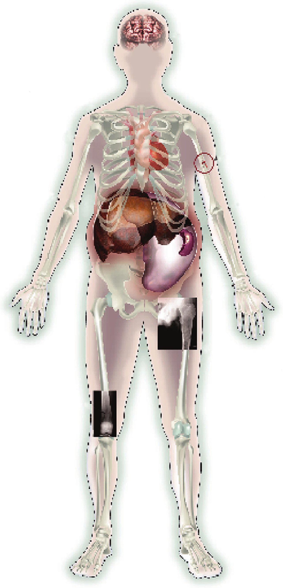
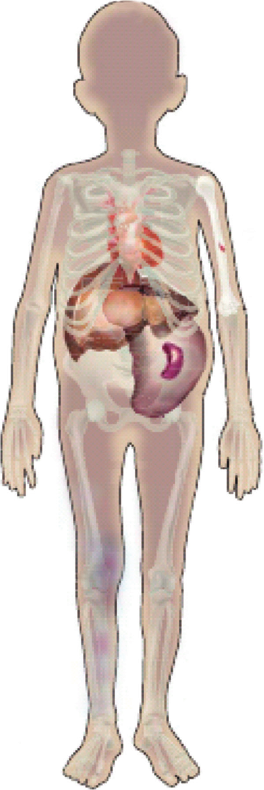

> Drug Evaluation
>
>  style="width:3.52017in;height:2.56653in" /> style="width:2.9592in;height:2.21875in" /> style="width:1.6875in;height:0.8316in" /> style="width:0.52778in;height:0.25781in" /> style="width:0.4783in;height:0.19531in" /> style="width:0.74045in;height:0.12413in" />**Imiglucerase** **and**
> **its** **use** **for** **the** **treatment** **of** **Gaucher’s**
> **disease**

1\. Introduction

2\. Development of a therapeutic glucocerebrosidase

3\. Imiglucerase pharmacokinetics

4\. Preparation and administration of imiglucerase for injection

5\. Clinical experience with imiglucerase

6\. Imiglucerase efficacy

7\. Pediatric response to

> imiglucerase

Neal J Weinreb

*University* *Research* *Foundation* *for* *Lysosomal* *Storage*
*Diseases,* *Inc.,* *Northwest* *Oncology* *Hematology* *Associates*
*PA,* *8170* *Royal* *Palm* *Boulevard,* *Coral* *Springs,* *FL*
*33065,* *USA*

*Background*: Gaucher’s disease is caused by deficient lysosomal
glucocerebrosidase activity. Intravenous enzyme replacement therapy with
imiglucerase (Cerezyme ®, Genzyme Corporation, Cambridge, MA), a
recombinant human glucocerebrosidase, ameliorates systemic
manifestations such as hepatosplenomegaly, anemia, thrombocytopenia and
skeletal abnormalities in patients with type 1 (non-neuronopathic) and
type 3 (chronic neuronopathic) Gaucher’s disease. *Objective/methods*:
The aim of this study was to identify and comment on the current issues
related to imiglucerase for Gaucher’s disease based on a review of
published

English language literature and personal clinical experience. *Results*:
The

8\. Imiglucerase and pregnancy

9\. Imiglucerase and type 3 Gaucher’s disease

10\. Dose of imiglucerase

11\. Treatment interruption

12\. Imiglucerase postmarketing surveillance

13\. Safety and tolerability of imiglucerase

14\. Alternative pharmacological therapies

15\. Expert opinion and conclusion

following topics were covered with respect to imiglucerase: development,
pharmacokinetics, preparation and administration, efficacy, pediatrics,
pregnancy, type 3 Gaucher’s disease, dosing, treatment interruptions,
safety and alternative pharmacological therapies. *Conclusion*:
Imiglucerase is safe and well tolerated. In addition, it corrects the
hepatic, splenic, hematologic and bone abnormalities observed with types
1 and 3 Gaucher’s disease effectively and enhances health-related
quality of life.

**Keywords:** enzyme replacement therapy, Gaucher’s disease,
imiglucerase, lysosomal storage disorders

*Expert* *Opin.* *Pharmacother.* *(2008)* ***9**(11):1987-2000*

**1.** **Introduction**

Gaucher’s disease, the most common lysosomal disorder, is caused by
mutations in the gene encoding acid β-glucosidase (glucocerebrosidase, E
3.2.1.45). It is inherited as an autosomal recessive trait. Classically,
there are three major subtypes: type 1 (non-neuronopathic), type 2
(acute neuronopathic) and type 3 (chronic neuronopathic). Type 1
Gaucher’s disease is the most prevalent (94%) and is differentiated from
type 2 (1%) and type 3 (5%) by the absence of primary CNS involvement
\[1\]. Gaucher’s disease has erroneously been described as a disorder
primarily affecting Ashkenazi Jews (1:600 – 800). However, Gaucher’s
disease is not limited to this population and estimates of the incidence
in non-Ashkenazi populations vary from 1:57 000 \[2\] to 1:75 000 \[3\]
live births.

More than 260 polymorphisms and disease-causing mutations have been
reported \[1\]. Worldwide, the most common Gaucher’s disease genetic
defect is a point mutation resulting in an asparagine to serine
substitution at amino acid 370 (N370S) \[1,4\]. This N370S mutant
glucocerebrosidase has sufficient residual catalytic activity to ensure
apparently normal CNS function in affected homozygous or compound
heterozygous individuals. The substitution of a proline for leucine at
amino acid 444 (L444P), particularly when associated with complex
recombinant mutations, usually results in a severely dysfunctional
enzyme. Affected homozygous individuals and some L444P compound
heterozygotes often have neuronopathic disease. Other mutations found
predominantly in specific ethnic populations are associated with either
unique phenotypes (D409H) or with relatively severe systemic
manifestations (84GG, IVS 2 + 1). However, the marked

>  style="width:1.52778in;height:0.19444in" />10.1517/14656560802221293 ©
> 2008 Informa UK Ltd ISSN 1465-6566 **1987** All rights reserved:
> reproduction in whole or in part not permitted

**Imiglucerase**

>  style="width:2.56533in;height:5.32033in" />Neurological involvement
>
> Thrombocytopenia
>
> Bone crisis Anemia
>
> Pathological fracture
>
> Hepatomegaly
>
> Splenomegaly
>
> Erlenmeyer flask deformity
>
> Collapsed vertebra
>
> Osteonecrosis

Osteopenia

**Figure** **1.** **Affected** **organ** **involvement** **in**
**adults** **with** **Gaucher’s** **disease.**

phenotypic heterogeneity within any given genotype suggests that
epigenetic and environmental factors contribute to the considerable
variation observed with respect to the age of onset and severity of the
clinical signs and symptoms \[1,4\].

Defective glucocerebrosidase activity leads to intra-cellular
accumulation of glucosylceramide \[5\] and other glycosphingolipids
\[6\] that may impact on receptor function and cell signaling \[7\]. Due
to a heavy substrate burden, intralysosomal storage of glucosylceramide
is particularly prominent in reticuloendothelial phagocytes. Organs
containing large numbers of cells of monocytic/macrophage lineage are
most affected, with resultant bone marrow infiltration with so-called
Gaucher’s cells, hepatosplenomegaly, anemia, thrombocytopenia \[1,8\]
and usually asymptomatic leucopenia (**Figure** **1**). Clinical
morbidity with radiological evidence of skeletal abnormalities is very
common \[1,8,9\]. Progressive pulmonary infiltration may be life
threatening but is rare. Children with symptomatic disease often have
growth retardation \[10\] and a delayed onset of puberty (**Figure**
**2**) \[11\].

With the prominent exception of some individuals homozygous for N370S
\[12\] and a smaller number with other so-called ‘mild’ genotypes, the
natural course of Gaucher’s disease is sporadically progressive and
potentially disabling \[13,14\]. Before the development of specific
therapy the palliative measures included invasive (splenectomy and
orthopedic surgery) and non-invasive (analgesics and assistive devices)
interventions. These neither altered nor prevented disease progression,
irreversible disease sequelae or the shortened life expectancy in
symptomatic patients \[15\]. Furthermore, splenectomy may create
additional morbidity in the form of accelerated bone disease \[16\] and
pulmonary hypertension \[17\].

The current standard of care for type 1 Gaucher’s disease and for the
systemic manifestations of type 3 Gaucher’s disease is enzyme
replacement therapy with intravenous infusions of the mannose
receptor-targeted recombinant human glucocerebrosidase imiglucerase
(Cerezyme®, Genzyme Corporation, Cambridge, MA) \[18-21\]. The
development of safe and effective enzyme therapy \[22\] has dramatically
altered

**1988** *Expert* *Opin.* *Pharmacother.* (2008) **9**(11)

> **Weinreb** style="width:1.52778in;height:0.19444in" />
>
> Growth retardation
>
>  style="width:1.467in;height:4.37867in" />Anemia
>
> Bone disease
>
> Hepatomegaly
>
> Splenomegaly
>
> Thrombocytopenia

**Figure** **2.** **Affected** **organ** **involvement** **in**
**children** **with** **Gaucher’s** **disease.**

Aadapted from Kaplan *et* *al.* \[10\].

the natural course of Gaucher’s disease. Imiglucerase ameliorates the
hepatic, splenic, hematologic, pulmonary \[18,23\] and bone
abnormalities \[9,24,25\] observed with types 1 and 3 Gaucher’s disease.
However, imiglucerase has no proven neurological benefits for types 2 or
3 Gaucher’s disease \[21,26,27\] . For babies with type 2 Gaucher’s
disease and their families little can be offered other than palliation,
genetic counseling and future prevention.

This article reviews the published data addressing the efficacy and
safety of imiglucerase for the treatment of patients with Gaucher’s
disease. The only other treatment approved by the FDA is Zavesca
(miglustat), the use of which is currently limited to adult patients
with mild-to-moderate type 1 Gaucher’s disease for whom enzyme
replacement therapy is not a therapeutic option \[20\]. This and other
developmental new treatments will be described below.

**2.** **Development** **of** **a** **therapeutic**
**glucocerebrosidase**

Glucocerebrosidase, a lysosomal acid β-glucosidase \[28\], catalyzes the
hydrolysis of glucosylceramide to glucose and ceramide \[4\].

Glucosylceramide is insoluble in water. *In* *vivo*, glucocere-brosidase
activity is dependent on the small acidic activator glycoprotein saposin
C, which facilitates the formation of a complex between the enzyme and
the lysosomal membrane \[29\]. Rare cases of hereditary saposin C
deficiency usually present with neuronopathic Gaucher’s disease \[30\],
although two patients with saposin C deficiency and type 1 Gaucher’s
disease have now been described \[31\] .

Brady \[32\] conceived of intravenous enzyme replacement as a possible
treatment for Gaucher’s disease over 40 years ago. Proof of the concept
of enzyme replacement therapy for Gaucher’s disease was achieved when
two patients were treated with a limited quantity of purified human
placental glucoce-rebrosidase and their plasma and hepatic
glucocerebroside decreased \[33,34\]. However, animal studies that
showed that most infused glucocerebrosidase was taken up by hepatocytes
and only small amounts of the enzyme actually entered macrophages
(Kupffer cells) brought the future of enzyme replacement therapy into
question \[35\] .

Glucocerebrosidase is a 67 kDa glycoprotein containing ∼ 7%
carbohydrate. Reticuloendothelial uptake was greatly improved after
glucocerebrosidase was enzymatically deglycosylated to expose mannose
residues capable of binding to macrophage mannose receptors \[36\]. The
purification and carbohydrate remodeling scheme was subsequently adapted
and scaled up by the Genzyme Corporation. After additional steps to
eliminate the risk of viral contamination, a small number of patients
were treated with mannose-terminated placental glucocerebrosidase,
culminating in a seminal trial of 12 patients \[22\]. When consistent
improvements were noted in hematological cytopenias and liver and spleen
volumes human placental glucocerebrosidase (alglucerase) was approved by
the FDA for the treatment of Gaucher’s disease in adults and in
children.

Alglucerase (Ceredase®,Genzyme Corporation, Cambridge, MA) became
commercially available in 1991 \[4,37\]. Approximately 20, 000 placentas
were required to extract enough glucocerebrosidase to treat one patient
for 1 year \[4\]. Moreover, alglucerase contained human serum albumin
and a low level of protein impurities such as human chorionic
gonadotropin. In order to ensure an adequate supply of enzyme and to
eliminate completely the potential risks associated with the use of a
human tissue-derived product, a recombinant human glucocerebrosidase
(imiglucerase) expressed in Chinese hamster ovary cells was developed
(Cerezyme®, Genzyme Corporation, Cambridge, MA) \[37\]. Chinese hamster
ovary technology is a widely accepted standard for the production of
recombinant therapeutic proteins \[38\]. The well-characterized
biological properties of Chinese hamster ovary cells and their
demonstrated safety record for the production of glycosylated human
proteins \[38,39\] ensure a continuous and highly pure supply of
imiglucerase.

Although the protein sequence of imiglucerase differs from that of
alglucerase by a single amino acid, the two proteins are enzymatically
indistinguishable \[4\]. In a randomized

> *Expert* *Opin.* *Pharmacother.* (2008) **9**(11) **1989**

**Imiglucerase**

clinical trial, imiglucerase was shown to be therapeutically similar to
alglucerase \[40\] and imiglucerase was approved for use in the US in
1994 and throughout Europe in 1997. In 1997, the completion of a
large-scale manufacturing facility allowed nearly all patients to
transfer from alglucerase to imiglucerase \[37\]. Imiglucerase is
currently used in more than 90 countries worldwide.

**3.** **Imiglucerase** **pharmacokinetics**

When imiglucerase is infused intravenously, steady-state enzymatic
activity is achieved within 20 – 30 min \[41\] . The elimination
half-life, plasma clearance and volume of distribution values are
independent of the infusion time. Within a dose range of 7.5 – 60 U/kg,
the elimination half-life, plasma clearance and volume of distribution
values are independent of the infused dose. The plasma enzymatic
activity half-life is 3.6 – 10.4 min. This short half-life is
advantageous because glucocerebrosidase is quickly inactivated in the
neutral pH of blood whereas rapid endocytosis stabilizes enzymatic
activity for lysosomal trafficking \[4\].

Studies identifying the cellular and tissue distribution of infused
glucocerebrosidase have been limited due to the absence of an animal
model that is clinically analogous to human Gaucher’s disease. The
uptake and tissue distribution of mannose-terminated glucocerebrosidase
was studied using a bolus injection of I123-labeled recombinant enzyme
in a total of eight patients with type 1 Gaucher’s disease (three
non-splenectomized and five splenectomized) and in one healthy (control)
patient \[42\]. The tracer enzyme was rapidly cleared from the blood
(half-life 4 – 7 min) and taken up by the liver (30% of injected dose),
spleen (15%) and bone marrow. The bone marrow half-life was 14.1 h.
Clearance from the viscera occurred in two phases: 40 – 55% was cleared
quickly (half-life 1 – 2 h) and 45 – 60% was cleared slowly (half-life
34 – 42 h).

**4.** **Preparation** **and** **administration** **of**
**imiglucerase** **for** **injection**

Imiglucerase is supplied as a sterile, non-pyrogenic, white to off-white
lyophilized product. It is reconstituted with sterile water for
injection \[41\]. After reconstitution, imiglucerase should be inspected
visually before use. Because this is a protein solution, slight
flocculation occasionally occurs after dilution. The diluted solution
may be filtered through an in-line low protein-binding 0.2-µm filter
during administration. Any vials exhibiting opaque particles or
discoloration should not be used. After reconstitution imiglucerase has
been shown to be stable for up to 12 h when stored at room temperature
(25°C) and up to 24 h at 2 – 8°C. Because imiglucerase does not contain
any preservative vials should not be retained for multiple use.

Worldwide, the mean imiglucerase dose per infusion is 30 – 35 U/kg
(International Collaborative Gaucher Group

(ICGG) Gaucher Registry data). Depending on the dose and history of any
infusion-related reactions, most imiglucerase infusions are completed in
1 – 2 h. Based on a study of alglucerase infusion in a single asplenic
patient with marked hepatomegaly and severe bone marrow infiltration,
Mistry *et* *al.* \[42\] calculated that mannose receptor saturation
occurred after a 1-h infusion of 35 U/kg and suggested that this rate of
infusion should not be exceeded. However, variation among patients in
terms of the efficiency of binding of infused imiglucerase to the
mannose receptor of Gaucher’s macrophages and the effect of the infusion
rate on response has not been systematically studied.

Education about a careful reconstitution and dilution technique for
preventing denaturation is important. In the US a minority of patients
are infused at Gaucher’s disease treatment centers with extensive
experience in administration of enzymatically active proteins. As a
significant convenience for patients, home therapy was initially
promoted in Israel \[43\] and is becoming increasingly prevalent both in
and even more so outside the US. More than 50% of imiglucerase patients
in the UK are on home infusions and a significant proportion of these
self-cannulate and self-infuse \[44\]. Home therapy has proven to be
successful for patients who chose this treatment option \[45\] .

**5.** **Clinical** **experience** **with** **imiglucerase**

The FDA licensed alglucerase and imiglucerase under the Orphan Drug Act
of 1983. The approval was contingent on postapproval surveillance that
led to the creation of the ICGG and the ICGG Gaucher Registry \[8\] and
implementation of safety monitoring through the pharmacovigilance
program \[37\]. Worldwide, over 5000 patients have been treated since
the introduction of alglucerase in 1991 (Genzyme Corporation, data on
file). This aggregate clinical experience has been the subject of more
than 350 papers, including 63 mostly retrospective studies with
sufficient detail for assessing the clinical effectiveness \[46\]. Few
randomized clinical trials with alglucerase or imiglucerase have been
attempted, primarily because of the rarity of the disease and ethical
qualms about the inclusion of a ‘no treatment’ arm. The largest
retrospective study to date was generated by the ICGG Gaucher Registry
\[23\], an international observational database of the clinical,
demographic and biochemical characteristics and treatment outcomes for
patients with Gaucher’s disease, regardless of disease severity or
treatment status \[8\]. This observational database has made it possible
to study Gaucher’s disease in large patient populations for follow-up
periods now exceeding 16 years.

Few studies have measured primary outcomes. There are no statistical
reports on the effect of imiglucerase on mortality in type 1 Gaucher’s
disease and the reference information about the mortality in untreated
patients is rudimentary. In untreated patients with type 1 Gaucher’s
disease, health-related quality of life scores assessed with the

**1990** *Expert* *Opin.* *Pharmacother.* (2008) **9**(11)

> **Weinreb** style="width:1.52778in;height:0.19444in" />

SF-36 Short Form Health Survey are often decreased \[47\] . Contributory
factors include a history of splenectomy, older age and concurrent
illnesses and manifestations of bone disease with chronic bone pain and
a history of necrosis, fracture or joint replacement. With imiglucerase
the SF-36 physical and mental component scores improve on average and,
within 2 years, are generally comparable to normative reference
populations. Moreover, after 2 – 4 years imiglucerase infusions have a
significant positive impact on health-related quality of life, even in
type 1 Gaucher’s disease patients with skeletal manifestations who are
sometimes thought to be refractory to treatment \[47\], including those
with bone infarctions, lytic lesions and osteonecrosis \[48\].

Nevertheless, without a clear relation to the length of time on therapy,
some patients with type 1 Gaucher’s disease continue with
moderate-to-severe psychological complications similar to patients with
other chronic illnesses \[49\]. For some, in particular those for whom
long-term imiglucerase infusions are intrusive and interfere with their
work and personal schedules \[50\], the availability of home therapy has
helped \[43,45\] . The sustained expense of imiglucerase treatment (on
average US\$ 150,000 – 350,000 annually in adult patients), which has
now been extensively discussed for many years in terms of societal
resources and pharmacoeconomic ethics \[46,51-53\] , may cause
substantial financial and emotional stress and guilt for individual
patients.

Most studies of the clinical efficacy of imiglucerase in Gaucher’s
disease have examined indicators of disease activity that are subject to
change in a time frame that is relatively short compared to overall life
expectancy. Frequently reported outcomes are changes in liver and spleen
volumes, hematological parameters such as hemoglobin concentrations and
platelet counts, biomarkers such as chitotriosidase and CCL-18, bone
marrow infiltration as assessed by magnetic resonance imaging (MRI)
techniques, bone pain severity reports, bone crisis occurrences and bone
mineral density (BMD).

**6.** **Imiglucerase** **efficacy**

A retrospective study \[23\] from the ICGG Gaucher Registry examined the
effectiveness of imiglucerase, regardless of disease severity or
treatment dose, in a large group of patients with type 1 Gaucher’s
disease who were treated for 2 – 5 years. Anemic patients usually
normalized within 6 – 12 months and responses were maintained throughout
the follow-up period. Platelet counts increased in thrombo-cytopenic
patients with splenomegaly during the first 2 years of therapy but did
not always normalize, especially when pretreatment thrombocytopenia was
pronounced. Slow but continued improvement occurred during years 2 – 5.
After 2 years, pretreatment hepatomegaly usually decreased 30 – 40% and
splenomegaly decreased 50 – 60%. Liver volumes generally normalized but
decreases in spleen volume to less than five times normal rarely
occurred.

With the exception of bone crises, for which recurrence or *de* *novo*
onset is rare with treatment \[23,24,54\], skeletal responses usually
occur later than hematological or visceral responses \[25\]. The
frequency and severity of bone pain often decrease within the first year
of therapy \[23,24,55\]. Vertebral and femoral bone marrow infiltration
by Gaucher’s cells decreases in a dose-dependent manner \[56\]. In a
series of 10 adult patients treated with ‘low-dose’ imiglucerase, the
BMD measured by dual energy X-ray absorptiometry (DXA) increased in six
patients (four women and two men) older than age 30 years but failed to
increase in four women aged 18 – 23 years \[57\]. An ICGG Gaucher
Registry study of 342 imiglucerase-treated osteopenic premenopausal
women (18 – 50 years old) and men (18 – 70 years old) showed that their
lumbar BMD *Z*-scores generally increased and sometimes normalized,
whereas the BMD generally decreased in the 160 untreated patients
\[25\]. It could require 8 years or longer to achieve an optimal
response and this appeared to be dose dependent, although gender
differences between dosage groups were not excluded ( **Figure** **3**).
Some osteoporotic patients had no improvement. Another study \[58\],
which used quantitative computed tomography (QCT) to measure patients’
BMD, showed initial decreases in splenectomized Gaucher’s disease
patients treated with imiglucerase for 6 – 12 months. Because of the
different methodologies and observation periods, it is difficult to
compare the QCT and DXA results. There is yet no definitive evidence
linking abnormal DXA BMDs and Gaucher’s disease skeletal complications,
nor proof that increasing BMDs in patients with type 1 Gaucher’s disease
will result in a long-term reduction in the fracture risk, as has been
shown in women with postmenopausal osteoporosis \[59\] and in osteopenic
patients with chronic inflammatory diseases such as rheumatoid arthritis
and Crohn’s disease \[60,61\]. In order to detect impending irreversible
skeletal damage, where the technology is accessible and affordable and
in accordance with published recommendations, children and adults with
Gaucher’s disease should have a comprehensive initial physical and
radiological (X-ray, MRI and DXA) evaluation for bone disease and
ongoing monitoring at least once every 2 years \[19,62-64\] .

**7.** **Pediatric** **response** **to** **imiglucerase**

Imiglucerase treatment is highly effective in children \[65\]. Most
pediatric patients with combinations of anemia, thrombocy-topenia and
hepatosplenomegaly improved within 1 – 2 years, with sustained responses
for 8 years. Children’s bone marrow glucocerebroside content decreased
\[66\], retarded growth patterns improved and bone disease symptoms
lessened \[65,67\] with imiglucerase. On average, the lumbar spine BMD
normalized after 6.6 years of treatment with imiglucerase \[65\], with
attainment of a peak mineral bone mass.

Children represent a significant majority of newly diagnosed patients
with type 1 Gaucher’s disease \[19\]. Early imiglucerase

> *Expert* *Opin.* *Pharmacother.* (2008) **9**(11) **1991**

**Imiglucerase**

> 1
>
> 0
>
> -1
>
> -2

||
||
||
||

0 UKG′2WK

0 UKG′2WK

5 UKG′2WK

> 0 1 2 3 4 5 6 7 8 **Years** **of** **DXA** **follow-up**

**Figure** **3.** **Dual** **energy** **X-ray** **absorptiometry**
**lumbar** **spine** ***Z*-score** **in** **type** **1** **Gaucher’s**
**disease** **patients** **treated** **with** **different** **doses**
**of** **imiglucerase.** Untreated Gaucher’s disease population: 86
women of age 18 – 50 years and 74 men of age 18 – 70 years.
Imiglucerase-treated population: 182 women of age 18 – 50 years and 160
men of age 18 – 70 years. The number of patients in each dose group was
equivalent in number, but the authors did not indicate whether the
proportions of men and women were identical in each dose group.

Adapted from Wenstrup *et* *al.* \[25\].

treatment is recommended for all children with physical signs or
symptoms of Gaucher’s disease because overt findings during the first
and second decades of life may predict a more severe and/or progressive
future disease course \[19,68\]. Treatment decisions for asymptomatic
children who are diagnosed as a result of parental or neonatal screening
are more problematic and best coordinated by geneticists or other
specialists with expertise and experience in Gaucher’s disease
assessment and management \[69\]. The recommendations for monitoring
children with type 1 Gaucher’s disease include a complete medical
history and baseline evaluations and monitoring at regular intervals
(**Table** **1** ) \[19\].

**8.** **Imiglucerase** **and** **pregnancy**

Imiglucerase has a pregnancy category C rating, meaning that ‘it is not
known whether it is harmful to an unborn baby and should be given to
pregnant women only if clearly needed’ \[70,71\]. The evidence about the
effects of imiglucerase on pregnancy and childbirth come solely from
retrospective and case studies \[72-74\].

Imiglucerase and alglucerase have been continued without interruption
throughout pregnancy with successful full-term delivery \[73\]. In 23
imiglucerase-treated and 43 untreated pregnant patients, there was no
significant difference in the

live birth rate between the two groups \[75\] . The neonatal outcomes
were comparable in both the treated group and untreated group and there
were no adverse effects attributable to imiglucerase treatment. When
therapy is continued during pregnancy in women with more severe
pretreatment manifestations and hematological, visceral and skeletal
improvements are maintained, the risk of complications such as
miscarriages \[72,75\], bleeding, infections and bone crises during
pregnancy, in the delivery room and postpartum is decreased, although
not necessarily eliminated \[11,75-77\].

All women with Gaucher’s disease should be carefully monitored
throughout pregnancy. The management of pregnancy optimally requires a
cooperative multidisciplinary approach \[77\] including, when indicated
by the patient’s initial presentation and subsequent course, an
obstetrician, anesthesiologist, hematologist, orthopedic specialist and
clinical geneticist with knowledge of Gaucher’s disease. Many women
elect to stop treatment during the first trimester of pregnancy,
although to date no cases of congenital defects have been associated
with imiglucerase. Continued imiglucerase after the first trimester is
advised for all women with Gaucher’s disease who were on therapy prior
to pregnancy and for previously untreated symptomatic women who would
normally be offered imiglucerase were they not pregnant \[76\] .

**1992** *Expert* *Opin.* *Pharmacother.* (2008) **9**(11)

> **Weinreb** style="width:1.52778in;height:0.19444in" />

**Table** **1** **.** **Recommended** **schedule** **for**
**evaluation** **and** **monitoring** **of** **patients** **with**
**type** **1** **Gaucher’s** **disease** **(revised** **from**
**\[15\]).**

**Assessment** **Untreated** **patients** **Treated** **patients**

> **Every** **12** **months**

***Blood*** ***tests***

**Every** **12** **–** **24** **months** **Every** **3** **months**
**Every** **12** **–** **24** **months§** **At** **the** **time** **of**

> **dose** **change**

Hemoglobin X – X – X Platelet count X – X – X Biomarkers\* X – X – X

***Visceral***

Spleen volume ‡ – X – X X Liver volume‡ – X – X X

***Skeletal***

Skeletal X-ray – X – X X Skeletal MRI – X – X X DXA (lumbar spine) – X –
X X

***Quality*** ***of*** ***life***

SF-36 X – – X X

\*The biomarkers are measurements of chitotriosidase, CCL-18,
angiotensin-converting enzyme and/or tartrate resistant acid
phosphatase. ‡Assessment by any method of measurement.

§Depending on duration of treatment and clinical status of the patient.

**9.** **Imiglucerase** **and** **type** **3** **Gaucher’s** **disease**

Enzyme therapy for the treatment of the neurological symptoms of type 3
Gaucher’s disease has been attempted, even though imiglucerase does not
cross the blood–brain barrier \[78\]. The results were not encouraging
in a study of Swedish patients \[79\]. Published observations and
anecdotal reports have suggested that non-myoclonic manifestations of
type 3 Gaucher’s disease may sometimes ameliorate with enzyme therapy
\[80\].

In 2001 the European Working Group on Gaucher Disease proposed treatment
guidelines for treating type 3 patients \[80\] . The suggested starting
dose was 120 U/kg every 2 weeks, doubling the dose to 240 U/kg if
neurological involvement progressed. These guidelines were reviewed in
2006 based on collected outcomes in 55 European patients with type 3
Gaucher’s disease \[21\]. In the majority of these patients there was no
evidence that doses of imiglucerase of 120 – 240 U/kg every 2 weeks made
any difference in neuronopathic manifes-tations such as seizure activity
or decline in cognitive function \[21,81\]. The results were most
disappointing in the youngest patients, who received the highest doses
for the longest duration of follow-up. Thus, in the author’s opinion,
there is no current cogent reason to initiate or continue very high-dose
imiglucerase therapy in patients with type 3 Gaucher’s disease. However,
patients with type 3 Gaucher’s disease should receive conventional
imiglucerase treatment for the non-neurological aspects of Gaucher’s
disease \[81\] .

**10.** **Dose** **of** **imiglucerase**

In 2005 the ICGG US Scientific Advisory Board published suggestions for
the individualization of initial and maintenance dosing for patients
with type 1 Gaucher’s disease \[68\]. The recommended initial dose of
imiglucerase is 60 U/kg every 2 weeks for all children and for adults
with severe disease \[68\]. Imiglucerase can be started at a dose of 30
– 45 U/kg every 2 weeks for adults with lesser risk and for those with
limited skeletal disease (mild osteopoenia and Erlenmeyer flask
deformity), normal major organ function, minimally impaired quality of
life and no evidence of or rapid progression of disease manifestations
\[68\] . The minimum recommended long-term maintenance dose is 30 U/kg
every 2 weeks \[68\] .

For reasons of economy as well as for enhanced efficiency of enzyme
delivery, lower doses have been advocated \[82\] and improvements in
visceral and hematologic responses to such doses have been documented
\[83-86\]. Some patients on low-dose therapy have not achieved adequate
skeletal responses or have had continued skeletal complications
\[87,88\]. However, the author is also aware of patients, many of whom
have been previously splenectomized, who, despite several years of
biweekly imiglucerase treatment at doses of 30 – 60 U/kg, have
continuing skeletal complaints including episodic post-treatment
osteonecrosis with persistently elevated biomarker levels and others who
have not achieved therapeutic goals for splenomegaly or platelet count.

> *Expert* *Opin.* *Pharmacother.* (2008) **9**(11) **1993**

**Imiglucerase**

>  style="width:5.12033in;height:3.307in" />Disease management pathway
>
> Continue comprehensive regular monitoring
>
> Perform comprehensive initial assessment

Establish appropriate therapeutic goals

Individualize therapy

> Assess status against goals
>
> Initial data entry Ongoing data entry

**Figure** **4.** **Use** **of** **the** **Gaucher** **Registry** **as**
**a** **disease** **management** **tool.**

Because the parameters that govern the responsiveness to imiglucerase
likely include the extent of fibrosis and complex lesions that determine
the delivery of enzyme molecules to macrophage cell surfaces,
differential uptake of imiglucerase by organ compartment and
differential expression of mannose receptors depending on relative
proportions of classically versus alternatively activated macrophages,
it is, in the author’s mind, unlikely that clinically important
long-term outcomes in patients with type 1 Gaucher’s disease will be
defined in terms of a simple dose–response relationship.

Because patients respond to a variety of doses, it is recommended that
therapy be individualized for each patient based on their disease
severity and rate of disease progression as assessed by clinical,
laboratory and radiological evaluation and consideration of the
patient’s quality of life. These factors can be assessed in terms of the
achievement of therapeutic goals and outcomes \[89\]. When monitoring
results indicate that all clinically important therapeutic goals are
met, the dose of imiglucerase can be adjusted \[19,68\]. A disease
management approach has been established that takes into account the
evaluation and monitoring of the disease, offers therapeutic goals and
provides suggestions for individualized dosing (**Figure** **4**).

**11.** **Treatment** **interruption**

Like many other aspects of type 1 Gaucher’s disease, the response to
cessation of imiglucerase is heterogeneous. Elstein *et* *al.* \[90\]
described 13 adults and two children who, after 5 – 56 months of enzyme
therapy, appeared to tolerate drug interruptions of 8 – 47 months
without adverse skeletal or pulmonary

consequences. However, a number of study patients with persistent
thrombocytopenia at the time therapy was inter-rupted did have
subsequent decreases in their platelet counts, sometimes to pretreatment
levels \[91\]. The cessation of imig-lucerase was also associated with
marked regression of previ-ous hematological and visceral improvement in
three out of four patients (two adults and two children) with type 1
Gaucher’s disease \[92\]. However, one N370S homozygous patient remained
clinically stable for several years after treat-ment was discontinued, a
phenomenon that the author has also personally observed in two patients
with this genotype. Severe symptomatic rebound hepatosplenomegaly
occurred in a 19-year-old man within 2 years of discontinuation of
therapy occasioned by an atypical symptom complex includ-ing muscle
rigidity, chest pain, trembling and anxiety \[93\]. Treatment
interruptions of 15 – 36 months in five children with type 1 Gaucher’s
disease resulted in recurrent or wors-ening organomegaly, hematological
parameters, bone mani-festations and growth retardation that persisted
11 months after resumption of therapy \[94\].

There is a consensus that interruption of imiglucerase treatment in
symptomatic children should be discouraged in order to avoid recurrent
organomegaly, growth delays and skeletal manifestations that may never
resolve despite restart-ing treatment \[90,93\]. In the absence of
supporting data from even a single prospective, controlled clinical
trial, it is the author’s opinion that interruption of imiglucerase
treatment for more than a few doses should not be recommended in adults
who were symptomatic prior to starting imiglucerase and who have
achieved their therapeutic goals. It is unfortunate that an opportunity
for scientifically assessing the effects

**1994** *Expert* *Opin.* *Pharmacother.* (2008) **9**(11)

> **Weinreb** style="width:1.52778in;height:0.19444in" />

of imiglucerase interruption was missed when the designers of a
switch-over study testing the efficacy of miglustat for maintenance of
stable imiglucerase-treated patients elected not to include a placebo
control group \[95\].

It may be possible to reduce the dose or frequency of imiglucerase
treatment in stable patients after the first years of imiglucerase
therapy \[68\]. The results from a recent randomized prospective trial
suggested that, for patients on imiglucerase therapy (20 – 60 U/kg every
2 weeks) for ≥ 2 years who had achieved all applicable therapeutic
goals, a dosing frequency of every 4 weeks at the equivalent 4-week
total dose may be considered \[96\]. However, long-term follow-up of
patients on an every 4 weeks dosing regimen is necessary in order to
determine other clinical outcomes such as bone mineralization and marrow
infiltration. Regular monitoring of all clinical aspects of Gaucher’s
disease based upon a recommended schedule of assessments \[62\] is
essential for all patients after any change in imiglucerase dose or
schedule of administration.

**12.** **Imiglucerase** **postmarketing** **surveillance**

The Genzyme Corporation maintains a global postmarketing adverse event
reporting system and a voluntary immunosur-veillance program \[37\]. The
goal of this program is to detect any previously unrecognized safety
concerns and understand better the long-term safety and immunogenicity
profile of imiglucerase in a large population of treated patients.

**13.** **Safety** **and** **tolerability** **of** **imiglucerase**

Imiglucerase is safe and well tolerated \[37\]. Approximately 13.8% of
all treated patients experience non-serious adverse events \[41\],
despite which most continue imiglucerase therapy \[37\]. The most
frequently reported adverse events are infusion related \[37\],
including pyrexia, chills, discomfort, urticaria, rash, pruiritus,
swelling or sterile abscess at the venipuncture site: each occurs in \<
1.5% of the total patient population \[41\]. Infusion-related adverse
events either decrease with continued treatment or are managed by
decreasing the infusion rate or pretreatment with an antihistamine
\[37\].

Immunoglobulin E seroconversion has occurred only once, in an
alglucerase-treated patient \[97\]. Approximately 15% of patients
develop IgG antibody to imiglucerase, although rarely after the first
year of treatment. Many become tolerant over time \[97\]. Seroconversion
very rarely neutralizes the efficacy of imiglucerase \[37\].

Pulmonary hypertension has been observed in less than 1% of the patient
population during treatment with imiglucerase \[41\]. Pulmonary
hypertension detected with Doppler echocardiography was reported in nine
out of 73 enzyme-treated Israeli patients, six of whom were surgically
asplenic \[98\]. Pulmonary hypertension was not detected in 61 untreated
patients. Subsequently, Mistry *et* *al.* \[17\] screened 134
consecutive patients and found mild asymptomatic

pulmonary hypertension in 30% of 40 untreated patients and in 7.4% of 94
alglucerase- or imiglucerase-treated patients. Nine previously
splenectomized patients had severe, life-threatening pulmonary
hypertension, five of whom were untreated. The four enzyme-treated
patients had histories of poor infusion compliance and improved with
aggressive enzyme/vasodilator therapy. Thus, no causal relationship
between pulmonary hypertension and imiglucerase treatment has yet been
established. Echocardiography is still recommended for monitoring adult
type 1 Gaucher’s disease patients for pulmonary hypertension,
particularly those with prior splenectomy \[62\]. However, based on 10
years of serial follow-up of 71 pediatric Israeli patients, none of whom
developed pulmonary hypertension, routine echo-cardiographic monitoring
in imiglucerase-treated children is probably unnecessary \[99\].

Arthritic-like pain in the small joints of the hands and/or feet after
initiation of imiglucerase treatment has been reported \[100\]. Some
patients improve with discontinuation of imiglucerase therapy. The cause
and frequency of this reaction is unknown. It is not specifically
included among the adverse events reported by Genzyme Pharmacovigilance
\[37\], but may be under-reported due to confusion or overlap with
Gaucher’s disease-related bone pain. The author is personally aware of
at least four patients with this symptomatology, two of whom improved
when imiglucerase was halted.

**14.** **Alternative** **pharmacological** **therapies**

Imiglucerase is the current standard of care worldwide for type 1
Gaucher’s disease \[20\]. The only other treatment currently approved by
the FDA is oral miglustat, the use of which is indicated for adult
patients with mild-to-moderate type 1 Gaucher’s disease for whom
imiglucerase is not a therapeutic option \[101\]. Miglustat
(*N*-butyldeoxynojirimycin) (NB-DNJ, Zavesca®) is a small molecule
iminosugar inhibitor of glucosylceramide synthase, the conceptual
efficacy of which for Gaucher’s disease is related to the observation
that nearly all mutant glucocerebrosidases have a degree of residual
catalytic activity. As miglustat reduces the overall substrate burden by
inhibiting biosynthesis, stored glucocerebroside may be eventually
cleared even by a defective glucocerebrosidase.

The hematological and visceral responses reported with miglustat for
untreated patients are less robust and take longer to achieve than those
reported with imiglucerase \[20\]. With regard to skeletal responses,
there are limited retrospective pooled data from 72 patients with type 1
Gaucher’s disease, 57% of whom were treated with enzyme therapy prior to
receiving miglustat. Over 2 years miglustat monotherapy reduced the
incidence of bone pain and improved lumbar spine and femoral neck BMD
*Z*-scores an average of 0.15 – 0.23 Z units \[102\] .

Thirty-six patients with stable Gaucher’s disease after prior
imiglucerase treatment were switched to maintenance oral

> *Expert* *Opin.* *Pharmacother.* (2008) **9**(11) **1995**

**Imiglucerase**

miglustat monotherapy for 6 – 24 months \[95\]. The hematological and
visceral status remained stable in most patients. Common side effects
included diarrhea (88%), flatulence (50%), abdominal pain (47%),
decreased weight (82%) and tremor (35%) \[95\]. In other studies
miglustat-associated gastrointestinal disturbances were milder and less
common and resolved after compliance with dietary recommendations. The
mild hand tremor seen in three out of 25 patients was no worse than that
associated with caffeine intake \[103\]. In the author’s opinion,
miglustat currently appears to have a limited role in the management of
treatment-naive patients with type 1 Gaucher’s disease and its efficacy
as a maintenance agent requires further and longer-term evaluation.
Miglustat is contraindicated in pregnancy (FDA) and patients on
miglustat should use contraceptive methods \[101\]. Miglustat is
permeable to the blood–brain barrier \[104\], but is not effective for
the neurological manifestations of type 3 Gaucher’s disease (R
Schiffmann, personal communication).

A gene-activated glucocerebrosidase (velaglucerase) produced in a human
cell line and possessing an amino acid sequence identical to native
human glucocerebrosidase is in Phase III clinical trials. The
pharmacokinetic profile of velaglucerase is similar to that of
imiglucerase \[105\]. A Phase I/II trial extended to 36 months (60 → 30
U/kg Q2W) has shown that the hematological, visceral and biomarker
responses in treatment-naive patients are comparable to those observed
for imiglucerase at comparable doses and schedules \[106\]. Lower dose
regimens have not yet been investigated. Velaglucerase was generally
well tolerated and no patient developed antibodies to it. A
plant-derived glucocerebrosidase with intrinsic exposed mannose residues
and a crystal structure similar to imiglucerase is also starting
clinical trials \[107\]. A Phase I safety trial has shown that the
plant-derived glucocerebrosidase is well tolerated in dosing as high as
60 U/kg without significant immune reactions or production of antibodies
\[108\]. Pharmacokinetic studies have shown a peripheral blood half-life
that is prolonged relative to imiglucerase, but any functional
significance of this observation is as yet undetermined.

An open-label Phase II trial of Genz-112638, an orally administered
ceramide analog that is a more potent and specific inhibitor of
glucosylceramide synthase than the iminosugar miglustat, was recently
completed. The preliminary results \[109\] for five adult patients with
type 1 Gaucher’s disease treated with Genz-112638 for 26 weeks showed
improvements in the hematological and visceral manifestations of type 1
Gaucher’s disease with one mild and transient adverse event.

AT2101 (isofagomine tartrate) is an orally administered small molecule
pharmacological chaperone that represents a new class of therapies for
genetic diseases. AT2101 is designed to bind mutant glucocerebrosidase
reversibly in the endoplasmic reticulum, thereby increasing enzyme
stability, trafficking to the lysosome and overall enzymatic activity
\[110\].

In single- and repeat-dose Phase I clinical trials in 54 healthy
volunteers, AT2101 was well tolerated with no serious adverse events
\[111\]. A dose-dependent increase in cell-cultured lymphoblast and
macrophage glucocerebrosidase levels (up to ∼ 3.5-fold) was observed
during a 7-day exposure period in an *ex* *vivo* study. The enzyme
levels remained elevated for more than 1 week after drug washout
\[111\]. A 4-week open-label randomized dose and safety trial of AT2101
was recently completed in 29 adult patients with type 1 Gaucher’s
disease \[112\] .

**15.** **Expert** **opinion** **and** **conclusion**

Imiglucerase is the current standard treatment for type 1 Gaucher’s
disease and is effective, safe and well tolerated. Imiglucerase
treatment effectively corrects hematological cytopenias, reduces
hepatosplenomegaly, decreases bone marrow infiltration, prevents
recurrent or new bone crises, ameliorates bone pain, restores bone
growth in children, improves BMD and enhances health-related quality of
life. Imiglucerase should be started before the development of
irreversible symptoms in order to prevent disability and a reduced
quality of life. Successful treatment for Gaucher’s disease with
imiglucerase depends on a comprehensive evaluation of all potential
disease compartments and individualized dosing that is tied to regular
monitoring of patients’ response as measured by the attainment of
multiple, quantifiable therapeutic goals. The efficacy and safety of
imiglucerase are benchmarks for the evaluation of all new potential
treatment modalities for Gaucher’s disease.

**Acknowledgments**

The author would like to thank the patients with Gaucher’s disease and
their physicians and healthcare personnel who submit data to the ICGG
Gaucher Registry and the Gaucher Registry support team at the Genzyme
Corporation. Further thanks are due to Andrea Gwosdow (PhD) for
assistance in preparing the manuscript. Finally, the author thanks
Carolyn Sawyer (PhD) and Susan Graham (BSc, MSc and MBChB) for critical
review of the manuscript, Tim Edmunds (PhD) for scientific discussion
and helpful suggestions and Robert Brown and Trent Richardson for
graphic design of the figures, all of whom are at the Genzyme
Corporation.

**Declaration** **of** **interest**

The author’s institution, the University Research Foundation for
Lysosomal Storage Diseases, Inc., is the recipient of a research and
educational grant from the Genzyme Corporation. Part of the author’s
salary is derived from this grant. The author serves as co-chairman of
the Scientific Advisory Board of the ICGG. In this capacity, the author
has received honoraria and travel expenses from the Genzyme

**1996** *Expert* *Opin.* *Pharmacother.* (2008) **9**(11)

> **Weinreb** style="width:1.52778in;height:0.19444in" />

Corporation for attending an average of three meetings annually. As a
member of the speakers’ bureau, the author has also received honoraria
and travel expenses from the Genzyme Corporation for lecturing to
physician audiences. The author has received honoraria and travel
expenses from the National Gaucher Foundation (a not-for-profit
tax-exempt organization) for lecturing to patient support groups. On
single occasions the author has received honoraria from the Actelion
Corporation, Shire Therapeutics Inc. and the Protalix Corporation for
attending meetings. These corporations are competitors to the Genzyme
Corporation in the area of

Gaucher’s disease and related lysosomal disorders. The author is
currently participating as a compensated principal investigator in two
clinical research trials with the Amicus Corporation (also a Genzyme
Corporation competitor) and one with Shire Therapeutics Inc. Neither the
author nor any relevant relative have any stock, bond or other ownership
position (except possibly via large diversified mutual funds) in any of
the commercial entities named above, nor does the author or any relative
have any patent interest or royalty interest in any drug or other
product related to Gaucher’s disease or any other disease.

**Bibliography**

Papers of special note have been highlighted as either of interest (•)
or of considerable interest (••) to readers.

1\. Grabowski G, Kolodny E, Weinreb N, et al. Gaucher disease:
phenotypic and genetic variation. In: Scriver CR, Al Beaudet,

> Valle D, Slye WS, editors, The online metabolic & molecular bases of
>
> inherited disease. New York: McGraw-Hill Publishers; 2006. Chapter
> 146.1. Available from: http://genetics.
> accessmedicine.com/server-java/Arknoid/
>
> amed/mmbid/co_chapters/ch146.1_p01.html \[Last accessed 31 March
> 2008\]

**••** **A** **comprehensive** **up-to-date** **review** **of** **the**
**phenotypic** **variation** **and** **genotype** **correlations**
**for** **all** **Gaucher’s** **disease** **variants.**

2\. Meikle PJ, Hopwood JJ, Clague AE, et al. Prevalence of lysosomal
storage

> disorders. JAMA 1999;281:249-54

7\. Langeveld M, Ghauharali KJ, Sauerwein HP, et al. Type 1 Gaucher
disease,

> a glycosphingolipid storage disorder, is associated with insulin
> resistance.
>
> J Clin Endocrinol Metab 2008;93:845-51

8\. Charrow J, Andersson HC, Kaplan P, et al. The Gaucher Registry
demographics and disease characteristics of 1698 patients with Gaucher
disease. Arch Intern Med

> 2000;160:2835-43

**•** **A** **detailed** **but** **dated** **description** **of**
**the** **ICGG** **Gaucher** **Registry,** **the** **largest**
**worldwide** **database** **ever** **compiled** **for** **Gaucher’s**
**disease.**

9\. Weinreb NJ. The bone in Gaucher disease. Eur Musculoskeletal Rev
2007;2:33-6

**•** **A** **review** **of** **the** **skeletal** **manifestations**
**of** **Gaucher’s** **disease:** **these** **are** **often** **the**
**source** **of** **the** **greatest** **morbidity** **and**
**disability.**

10\. Kaplan P, Andersson HC, Kacena KA,

> et al. The clinical and demographic

13\. Maaswinkel-Mooij P, Hollak C,

> Van Eysden-Plaisier M, et al. The natural course of Gaucher disease in
> The Netherlands: implications for monitoring of disease
> manifestations.
>
> J Inherit Metab Dis 2000;23:77-82

14\. Mistry PK, Sadan S, Yang R, et al. Consequences of diagnostic
delays in

> type 1 Gaucher disease: the need for greater awareness among
> hematologists–oncologists and an opportunity for early diagnosis
>
> and intervention. Am J Hematol 2007;82:697-701

15\. Lee RE. The pathology of Gaucher disease. In: Desnick RJ, Gatt S,
Grabowski GA, editors, Gaucher disease: a century of delineation and
research. New York:

> Liss; 1982. p. 177-217

16\. Fleshner PR, Aufses Jr AH, Grabowski GA, et al. A 27-year
experience with splenectomy for Gaucher’s disease.

> Am J Surg 1991;161:69-75

3\. Grabowski GA. Recent clinical progress in Gaucher disease. Curr Opin
Pediatr 2005;17:519-24

4\. Edmunds T. β-Glucocerebrosidase Ceredase® and Cerezyme®. In: McGrath
BM, Walsh G, editors, Directory of therapeutic enzymes. Boca Raton, FL:
CRC Press; 2006. p. 117-33

**•** **A** **detailed** **review** **of** **the** **development,**
**biochemistry** **and** **pharmacology** **of** **enzyme**
**replacement** **therapy.**

5\. Brady RO, Kanfer JN, Shapiro D. Metabolism of glucocerebrosidases.
II. Evidence of an enzymatic deficiency

> in Gaucher’s disease. Biochem Biophys Res Commun 1965;18:221-5

6\. Nilsson O, Mansson JE, Hakansson G, et al. The occurrence of
psychosine and other glycolipids in spleen and liver from the three
major types of

> Gaucher’s disease. Biochim Biophys Acta
>
> 1982;712:453-63
>
> characteristics of nonneuronopathic Gaucher disease in 887 children
>
> at diagnoses. Arch Pediatr Adolesc Med 2006;160:603-8

**•** **The** **largest** **series** **ever** **compiled** **that**
**describes** **Gaucher’s** **disease** **as** **a** **pediatric**
**disorder.**

11\. Granovsky-Grisaru S, Aboulafia Y, Diamant YZ, et al. Gynecologic and
obstetric aspects of Gaucher’s disease: a survey of 53 patients. Am J

> Obstet Gynecol 1995;172:1284-90

12\. Fairley C, Zimran A, Cizmarik M,

> et al. Phenotypic heterogeneity of N370S homozygotes with type 1
> Gaucher disease: an analysis of 798 patients from the ICGG Gaucher
> Registry. Presented at the annual meeting of the American Society of
> Genetics; 23 – 27 October 2007;
>
> San Diego, California. Available from:
> http://www.ashg.org/genetics/ashg06s/
>
> index.shtml \[Last accessed 31 March 2008\]

17\. Mistry PK, Sirrs S, Chan A, et al. Pulmonary hypertension in type 1
Gaucher’s disease: genetic and epigenetic determinants of phenotype and
response

> to therapy. Mol Genet Metab 2002;77:91-8

18\. Grabowski GA, Leslie N, Wenstrup RJ. Enzyme therapy in Gaucher
disease: the fi rst five years. Blood Rev

> 1998;12:115-33

19\. Charrow J, Andersson HC, Kaplan P, et al. Enzyme replacement
therapy and monitoring for children with type 1 Gaucher disease:
consensus recommendations. J Pediatr

> 2004;144:112-20

**•** **A** **clinically** **oriented** **review** **that** **provides**
**useful** **guidance** **for** **the** **management** **of**
**children** **with** **Gaucher’s** **disease.**

20\. Weinreb NJ, Barranger JA, Charrow J, et al. Guidance on the use of
miglustat for treating patients with type 1 Gaucher

> disease. Am J Hematol 2005;80:223-9
>
> *Expert* *Opin.* *Pharmacother.* (2008) **9**(11) **1997**

**Imiglucerase**

21\. Davies EH, Erikson A, Collin-Histed T, et al. Outcome of type III
Gaucher disease on enzyme replacement therapy: review of 55 cases. J
Inherit Metab Dis 2007;30:935-42

**••** **A** **recent** **critical** **appraisal** **of** **the**
**positive** **and** **negative** **outcomes** **associated** **with**
**enzyme** **replacement** **therapy** **for** **neuronopathic**
**Gaucher’s** **disease.**

22\. Barton NW, Brady RO, Dambrosia JM, et al. Replacement therapy for
inherited enzyme deficiency-macrophage-targeted glucerebrosidase for
Gaucher disease.

> N Engl J Med 1991;324:1464-70

23\. Weinreb NJ, Charrow J, Andersson HC, et al. Effectiveness of enzyme
replacement therapy in 1028 patients with type 1 Gaucher disease after 2
to 5 years of treatment: a report from the Gaucher Registry. Am J Med
2002;113:112-9

**••** **A** **large** **retrospective** **analysis** **documenting**
**the** **efficacy** **of** **enzyme** **therapy** **for** **many**
**manifestations** **of** **type** **1** **Gaucher’s** **disease.**

24\. Charrow J, Dulisse B, Grabowski GA, et al. The effect of enzyme
replacement therapy on bone crisis and bone pain

> in patients with type 1 Gaucher disease. Clin Genet 2007;71:205-11

**•** **The** **effect** **of** **imiglucerase** **on** **the**
**number** **of** **reports** **of** **bone** **pain** **and** **bone**
**crisis** **before** **and** **after** **therapy.**

25\. Wenstrup RJ, Kacena KA, Kaplan P, et al. Effect of enzyme
replacement therapy on bone mineral density in type 1 Gaucher disease. J
Bone Miner Res 2007;22:119-26

**•** **The** **effect** **of** **long-term** **treatment** **with**
**imiglucerase** **on** **BMD** **in** **patients** **with** **type**
**1** **Gaucher’s** **disease.**

26\. Prows CA, Sanchez N, Daugherty C, Grabowski GA. Gaucher disease:
enzyme therapy in the acute neuronopathic variant. Am J Med Genet
1997;71:16-21

27\. Elstein D, Abrahamov A, Zimran A. Ethical considerations for enzyme
replacement therapy in neuronopathic Gaucher disease. Clin Genet

> 1998;54:179-84

28\. Weinreb NJ, Brady RO, Tappel AL. The lysosomal localization of
sphingolipid hydrolases.

> Biochim Biophys Acta 1968;159:141-6

29\. Vaccaro AM, Salvioli R, Barca A, et al. Structural analysis of
saposin C and B. J Biol Chem 1995;270:9953-60

30\. Christomanou H, Kleinschmidt T, Braunitzer G. N-Terminal amino-acid

> sequence of a sphingolipid activator protein
>
> missing in a new human Gaucher disease variant. Biol Chem Hoppe Seyler
>
> 1987;368:1193-6

31\. Tylki-Szymanska A, Czartoryska B, Vanier M-T, et al.
Non-neuronopathic Gaucher disease due to saposin C deficiency. Clin Genet
2007;72:538-42

32\. Brady RO. Enzymatic abnormalities

> in diseases of sphingolipid metabolism. Clin Chem 1967;13:565-77

33\. Pentchev PG, Brady RO, Hibbert SR, et al. Isolation and
characterization of

> glucocerebrosidase from human placental tissue. J Biol Chem
> 1973;248:5256-61

34\. Brady RO, Pentchev PG, Gal AE, et al. Replacement therapy for
inherited enzyme deficiency. Use of purified glucocerebrosidase in the
Gaucher disease. N Engl J Med 1974;291:989-93

35\. Furbish FS, Steer CJ, Barranger JA, et al. The uptake of native and
desialylated glucocerebrosidase by rat hepatocytes and kupffer cells.
Biochem Biophy

> Res Commun 1978;81:1047-53

36\. Brady RO, Murray GJ, Baron NW. Modifying exogenous
glucocerebrosidase for effective replacement therapy in Gaucher disease.
J Inherit Metab Dis 1994;17:510-9

37\. Starzyk K, Richards S, Yee J, et al. The long-term international
safety experience of imiglucerase therapy for Gaucher disease. Mol Genet
Metab 2007;90:157-63

**••** **A** **recent** **update** **on** **the** **safety** **profile**
**for** **imiglucerase.**

38\. Jayapal KP, Wlaschin KF, Hu W-S, et al. Recombinant protein
therapeutics from CHO cells – 20 years and counting. Chem Eng Prog
2007;103:40-7

39\. Dingerman T. Recombinant therapeutic proteins: production platforms
and challenges. Biotechnol J 2008;3:90-7

40\. Grabowski GA, Barton NW, Pastores G, et al. Enzyme therapy in type
1

> Gaucher disease: comparative efficacy of mannose-terminated
> glucocerebrosidase from natural and recombinant sources. Ann Intern
> Med 1995;122:33-9

41\. Genzyme website. Available from:
http://www.cerezyme.com/global/pi.pdf \[Last accessed 20 June 2008\]

42\. Mistry PK, Wraight, EP, Cox TM. Therapeutic delivery of proteins to
macrophages: implications for treatment of Gaucher’s disease.

> Lancet 1996;348:1555-9

43\. Zimran A, Hollak CE, Abrahamov A, et al. Home treatment with
intravenous enzyme replacement therapy for Gaucher disease: an
international collaborative study of

> 33 patients. Blood 1993;82:1107-9

44\. Milligan A, Bruce R, Freud C, et al. Compliance with home treatment
using enzyme replacement therapy for type 1 Gaucher disease: a UK
centres perspective. Haematologica 2007;92(Suppl 1):222

45\. Milligan A, Hughes D, Goodwin S,

> et al. Intravenous enzyme replacement therapy: better in home or
> hospital? Br J Nurs 2006;15:330-3

46\. Connock M, Burls A, Frew E, et al. The clinical effectiveness and

> cost-effectiveness of enzyme
>
> replacement therapy for Gaucher’s disease: a systematic review. Health
> Technol Assess 2006;10:iii-iv, ix-136

**••** **A** **comprehensive** **review** **and** **critical**
**analysis** **of** **all** **clinical** **studies** **of** **enzyme**
**therapy** **reported** **throughout** **2005.**

47\. Giraldo P, Solano V, Perez-Calvo J-I, et al. Quality of life
related to type 1 Gaucher disease: Spanish experience. Qual Life Res
2005;14:453-61

48\. Weinreb N, Barranger J, Packman S,

> et al. Imiglucerase (Cerezyme ®) improves quality of life in patients
> with skeletal manifestations of Gaucher disease.
>
> Clin Genet 2007;71:576-88

**•** **The** **effect** **of** **imiglucerase** **on** **the**
**quality** **of** **life** **in** **Gaucher’s** **disease**
**patients** **with** **skeletal** **manifestations.**

49\. Packman W, Wilson Crosbie T, Riesner A, et al. Psychological
complications

> of patients with Gaucher disease.
>
> J Inherit Metab Dis 2006;29:99-105

50\. Mankin HJ, Trahan CA, Barnett NA, et al. A questionnaire study

> for 128 patients with Gaucher disease. Clin Genet 2006;69:209-17

51\. Garber AM. No price too high? N Engl J Med 1992;327:1676-8

52\. Moscicki RA, Taunton-Rigby A. Treatment of Gaucher’s disease. N
Engl J Med 1993;328:1564; author reply 1567-8

53\. Beutler E. Economic malpractice

> in the treatment of Gaucher’s disease. Am J Med 1994;97:1-2

54\. Elstein D, Hadas-Halpern I, Itzchaki M, et al. Effect of low-dose
enzyme replacement therapy on bones in Gaucher disease patients with

> severe skeletal involvement.

**1998** *Expert* *Opin.* *Pharmacother.* (2008) **9**(11)

> **Weinreb** style="width:1.52778in;height:0.19444in" />
>
> Blood Cells Mol Dis
>
> 1996;22:104-11; discussion 112-4

55\. Sims KB, Pastores GM, Weinreb NJ, et al. Improvement of bone
disease by

> imiglucerase (Cerezyme) therapy in patients with skeletal
> manifestations of type 1 Gaucher disease: results of a 48-month
> longitudinal cohort study. Clin Genet 2008;73:430-40

**•** **The** **effects** **of** **imiglucerase** **on** **bone**
**pain,** **bone** **crisis** **and** **BMD** **in** **type** **1**
**Gaucher’s** **disease.**

56\. De Fost M, Hollak CE, Groener JE, et al. Superior effects of
high-dose enzyme replacement therapy in type 1 Gaucher disease on bone
marrow involvement

> and chitotriosidase levels: a 2-center retrospective analysis. Blood
>
> 2006;108:830-5

57\. Lebel E, Dweck A, Foldes AJ, et al. Bone density changes with
enzyme therapy for Gaucher disease. J Bone Miner Metab 2004;22:597-601

58\. Schiffmann R, Mankin H, Dambrosia JM, et al. Decreased bone density
in splenectomized Gaucher patients

> receiving enzyme replacement therapy. Blood Cells Mol Dis
> 2002;28:288-96

59\. Watts NB. Bisphosphonate treatment of osteoporosis. Clin Geriatr
Med 2003;19:395-414

60\. Kelly C, Bartholomew P, Lapworth A, et al. Peripheral bone density
in patients

> with rheumatoid arthritis and factors which influence it. Eur J Intern
> Med 2002;13:423

61\. Robinson RJ, Al-Azzawi F, Iqbal SJ, et al. Osteoporosis and
determinants

> of bone density in patients with Crohn’s disease. Dig Dis Sci
> 1998;43:2500-6

62\. Weinreb NJ, Aggio MC, Andersson HC, et al. Gaucher disease type 1:
revised recommendations on evaluations

> and monitoring for adult patients. Semin Hematol 2004;41(S5):15-22

**••** **The** **most** **recent** **consensus** **regarding** **those**
**studies** **that** **are** **essential** **for** **comprehensive**
**monitoring** **of** **patients** **with** **Gaucher’s** **disease.**

63\. Vom Dahl S, Poll L, Di Rocco M,

> et al. Evidence-based recommendations for monitoring bone disease and
> the response to enzyme replacement therapy in Gaucher patients. Curr
> Med
>
> Res Opin 2006;22:1045-64

**•** **A** **critical** **review** **of** **the** **modalities**
**that**

> **should** **be** **applied** **to** **the** **evaluation** **of**
>
> **skeletal** **involvement** **in** **patients** **with**
> **Gaucher’s** **disease.**

64\. Grabowski GA, Andria G, Baldellou A,

> et al. Pediatric non-neuronopathic Gaucher disease: presentation,
> diagnosis and assessment. Consensus statements.
>
> Eur J Pediatr 2004;163:58-66

65\. Andersson H, Kaplan P, Kacena K, et al. Eight-year clinical
outcomes of long-term enzyme replacement therapy in 884 children with
type 1 Gaucher disease. Pediatrics 2008; In press

**•** **The** **first** **long-term** **large** **patient** **series**
**describing** **enzyme** **therapy** **outcomes** **in** **children.**

66\. Rosenthal DI, Doppelt SH, Mankin HJ, et al. Enzyme replacement
therapy for Gaucher disease: skeletal responses to macrophage-targeted
glucocerebrosidase. Pediatrics 1995;96:629-37

67\. Kaplan P, Mazur A, Manor O, et al. Acceleration of retarded growth
in children with Gaucher disease

> after treatment with alglucerase. J Pediatr 1996;129:149-53

68\. Andersson HC, Charrow J, Kaplan P,

> et al. For the International Collaborative Gaucher Group US Regional
> Coordinators. Individualization of long-term enzyme replacement
> therapy for Gaucher disease. Genet Med 2005;7:105-10

**•** **Dosing** **regimens** **recommended** **for** **use** **in**
**patients** **with** **type** **1** **Gaucher’s** **disease.**

69\. Azuri J, Elstein D, Lahad A, et al. Asymptomatic Gaucher disease
implications for large-scale screening. Genet Test 1998;2:297-9

70\. Food And Drug Administration: Cerezyme prescribing data. Available
from: http://www.fda.gov/cder/foi/

> label/2002/20367slr055_Cerezyme_lbl.pdf \[Last accessed 9 July 2007\]

71\. European Agency For The Evaluation Of Medicinal Products: Cerezyme
prescribing data. Available from: http://www.emea.
europa.eu/humandocs/PDFs/EPAR/ Cerezyme/H-157-PI-en.pdf

> \[Last accessed 9 July 2007\]

72\. Elstein D, Granovsky-Grisaru S, Rabinowitz R, et al. Use of enzyme
replacement therapy for Gaucher disease during pregnancy. Am J Obstet
Gynecol 1997;177:1509-12

73\. Aporta Rodrigues R, Escobar Vedia JL, Navarro Castro AM, et al.
Alglucerase enzyme replacement therapy used safely

> and effectively throughout the whole
>
> pregnancy of a Gaucher disease patient. Haematologica 1998;83:852-3

74\. Cleary JE, Burke WM, Baxi LV. Pregnancy after avascular necrosis of
the femur complicating Gaucher’s disease.

> Am J Obstet Gynecol 2001;184:233-4

75\. Elstein Y, Eisenberg V, Granovsky-Grisaru S, et al. Pregnancies in
Gaucher disease:

> a 5-year study. Am J Obstet Gynecol 2004;190:435-41

76\. Cox TM, Aerts JMFG, Belmatoug N,

> et al. Management of non-neuronopathic Gaucher disease with special
> reference
>
> to pregnancy, splenectomy, bisphosphonate therapy, use of biomarkers
> and bone disease monitoring. J Inherit Metab Dis 2008; May 23 \[Epub
> ahead of print\]

**••** **A** **comprehensive** **and** **timely** **review** **of**
**specialized** **topics** **which** **are** **highly**

> **relevant** **for** **clinicians** **managing** **patients** **with**
> **Gaucher’s** **disease.**

77\. Ioscovich A, Elstein Y, Halpern S, et al. Anesthesia for obstetric
patients with Gaucher disease: survey and review.

> Int J Obstet Anesth 2004;13:244-50

78\. Lonser RR, Walbridge S, Murray GJ, et al. Convection perfusion of
glucocerebrosidase for neuronopathic Gaucher’s disease.

> Ann Neurol 2005;57:542-8

79\. Erikson A, Bembi B, Schiffmann R. Neuronopathic forms of Gaucher’s
disease. Baillieres Clin Haematol 1997;10:711-23

80\. Vellodi A, Bembi B, De Villemeur T, et al. Management of
neuronopathic

> Gaucher disease: a European consensus. J Inherit Metab Dis
> 2001;24:319-27

**•** **A** **consensus** **regarding** **managing** **patients**
**with** **neuronopathic** **(type** **3)** **Gaucher’s** **disease.**

81\. Zimran A, Elstein D. No justification for very high-dose enzyme
therapy for patients with type III Gaucher disease. J Inherit Metab Dis
2007;30:843-4

82\. Beutler E. Lysosomal storage diseases: natural history and ethical
and economic aspects. Mol Genet Metab 2006;88:208-15

83\. Figueroa ML, Rosenbloom BE, Kay AC. A less costly regimen of
alglucerase

> to treat Gaucher’s disease.
>
> N Engl J Med 1992;327:1632-6

84\. Hollak CE, Aerts JMFG, Goudsmit R, et al. Individualised low-dose
alglucerase therapy for type 1 Gaucher disease. Lancet 1995;345:1474-8

85\. Elstein D, Abrahamov A, Hadas-Halpern I, et al. Low-dose low
frequency

> imiglucerase as a starting regimen
>
> *Expert* *Opin.* *Pharmacother.* (2008) **9**(11) **1999**

**Imiglucerase**

> of enzyme replacement therapy
>
> for patients with type 1 Gaucher disease. Q J Med 1998;91:483-8

86\. Heitner R, Arndt S, Levin JB. Imiglucerase low-dose therapy for
paediatric Gaucher disease – a long-term cohort study.

> S Afr Med J 2004;94:647-51

87\. Cohen IJ, Katz K, Kornreich L, et al. Low-dose high-frequency
enzyme replacement therapy prevents fractures without complete
suppression of painful bone crises with severe juvenile onset type 1
Gaucher disease.

> Blood Cells Mol Dis 1998;24:296-302

88\. Wilson C, Spearing R, Teague L, et al. The outcome of clinical
parameters in

> adults with severe type 1 Gaucher disease
>
> Gaucher disease. Mol Genet Metab 2008;93:S41

97\. Rosenberg MA, Kingma W,

> Fitzpatrick MA, et al. Immunosurveillance of alglucerase enzyme
> therapy for
>
> Gaucher patients: induction of humoral tolerance in seroconverted
> patients after repeat administration. Blood 1999;93:2081-8

98\. Elstein D, Klutstein MW, Lahad A,

> et al. Echocardiographic assessment of pulmonary hypertension in
> Gaucher’s disease. Lancet 1998;351:1544-6

99\. Rosengarten D, Abrahamov A, Nir A, et al. Outcome of ten years’
echocardiographic follow-up in children with Gaucher disease.

> Eur J Pediatr 2007;166:549-51
>
> replacement therapy (ERT) with
>
> ‘gene-activated’ human glucocerebrosidase (GA-GCB) in patients with
> type I Gaucher disease. Mol Genet Metab 2008;93:S45

107\. Shaaltiel Y, Bartfeld D, Hashmueli S, et al. Production of
glucocerebrosidase with terminal mannose glycans for enzyme replacement
therapy of Gaucher’s

> disease using a plant cell system. Plant Biotechnol J 2007;5:579-90

108\. Aviezer D, Almon-Brill E, Shaaltiel Y,

> et al. Novel enzyme replacement therapy for Gaucher disease: on-going
> phase III clinical trial with recombinant human glucocerebrosidase
> expressed in plant cells. Mol Genet Metab 2008;93:S15

109\. Peterschmidtt J, Lukina E, Watman N,

> using very low dose enzyme replacement therapy. Mol Genet Metab
> 2007;92:131-6

89\. Pastores GM, Weinreb NJ, Aerts H,

> et al. Therapeutic goals in the treatment of Gaucher disease. Semin
> Hematol 2004;41(Suppl 5):4-14

**••** **Definition** **and** **justification** **for** **a**
**Gaucher’s** **disease** **clinical** **management** **system**
**based** **on** **achievable** **therapeutic** **goals.**

90\. Elstein D, Abrahamov A, Hadas-Halpern I, et al. Withdrawal of
enzyme replacement therapy in Gaucher’s disease.

> Br J Haematol 2000;110:488-92

91\. Weinreb NJ. Interruption in enzyme replacement therapy for Gaucher
disease. Br J Haematol 2001;113:1087-9

92\. Grinzaid KA, Geller E, Hanna SL,

> et al. Cessation of enzyme replacement therapy in Gaucher disease.
>
> Genet Med 2002;4:427-33

93\. Toth J, Erdos M, Marodi L. Rebound hepatosplenomegaly in type 1
Gaucher disease. Eur J Haematol 2003;70:125-8

94\. Drelichman G, Ponce E, Basack N, et al. Clinical consequences of
interrupting enzyme replacement

> therapy in children with type 1 Gaucher disease. J Pediatr
> 2007;151:197-201

95\. Elstein D, Dweck A, Attias D, et al. Oral maintenance clinical
trial with miglustat for type I Gaucher disease: switch from or
combination with intravenous enzyme replacement. Blood 2007;110:2296-301

96\. Weinreb N. Effect of enzyme replacement therapy with imiglucerase
(Cerezyme)

> every 4 weeks in patients with type I

100\. Itzchaki M, Lebel E, Dweck A, et al. Orthopedic considerations in
Gaucher disease since the advent of enzyme replacement therapy. Acta
Orthop Scand 2004;75:641-53

101\. Cox TM, Aerts JM, Andria G, et al.; Advisory Council to the
European Working Group on Gaucher disease. The role of the iminosugar
N-butyldeoxynojirimycin (miglustat) in the management of type 1
(non-neuronopathic) Gaucher disease:

> a position statement. J Inherit Metab Dis 2003;26(6):513-26

102\. Pastores GM, Elstein D, Hrebicek M, et al. Effect of miglustat on
bone disease in adults with type 1 Gaucher disease:

> a pooled analysis of three multinational, open-label studies. Clin
> Ther
>
> 2007;29:1645-54

103\. Giraldo P, Latre P, Alfonso P, et al.

> Short-term effect of miglustat in every day clinical use in
> treatment-naïve or previously treated patients with type 1 Gaucher’s
> disease. Haematologica 2006;91:703-6

104\. Actelion website. Available from:
http://www.actelion.com/uninet/www/ www_main_p.nsf/Content/Development+
Zavesca%C2%AE+%28miglustat%29 \[Last accessed 1 February 2008\]

105\. Zimran A, Loveday K, Fratazzi C, et al. A pharmacokinetic analysis
of a novel enzyme replacement therapy with

> Gene-Activated® human glucocerebrosidase (GA-GCB) in patients with
> type 1
>
> Gaucher disease. Blood Cells Mol Dis 2007;39:115-8

106\. Zimran A, Bhirangi K, Mensah R, et al. (118) 36 months on
treatment: open-label

> phase I/II long-term study of enzyme
>
> et al. Preliminary results of a phase 2 clinical trial of Genz-112638
> in patients with type 1 Gaucher disease. Mol Genet Metab 2008;93:32-3
>
> 110\. Street RA, Chung S, Wustman B, et al. The iminosugar isofagomine
> increases the activity of N370S mutant acid beta-glucosidase in
> Gaucher fibroblasts by several mechanisms. Proc Natl
>
> Acad Sci USA 2006;103:13813-8

111\. Wustman B, Pine C, Ranes B, et al. Pharmacological chaperone
therapy

> for Gaucher disease: mechanism of action, a survey of responsive
> mutations and phase I clinical trial results. Mol Genet Metab
> 2008;93:S44
>
> 112\. Weinreb N, Eng C, Fernhoff P, et al. A phase 2 clinical trial of
> the pharmacological chaperone AT2101 for the treatment of Gaucher
> disease. Presented at the annual meeting of the
>
> American College of Clinical Genetics; 12 – 16, March 2008; Phoenix,
> Arizona. Available from:
>
> http://submissions.miracd.com/SecureView/
> ACMG/9umloo9806tca2s5ger6.pdf
>
> \[Last accessed 18 March 2008\]

**Affiliation**

Neal J Weinreb MD

University Research Foundation for Lysosomal Storage Diseases, Inc.,

Northwest Oncology Hematology Associates PA, 8170 Royal Palm Boulevard,

Coral Springs, FL 33065, USA

Tel: +1 954 755 1904; Fax: +1 954 755 1910;

E-mail: boneal@winning.com

**2000** *Expert* *Opin.* *Pharmacother.* (2008) **9**(11)
